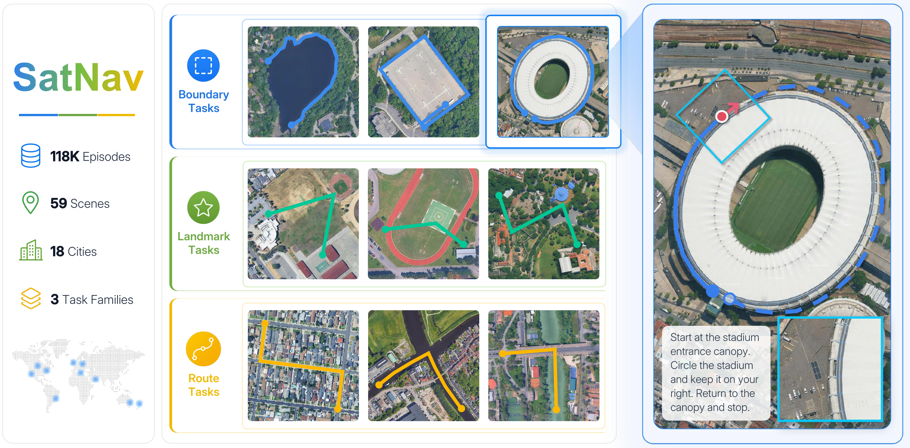
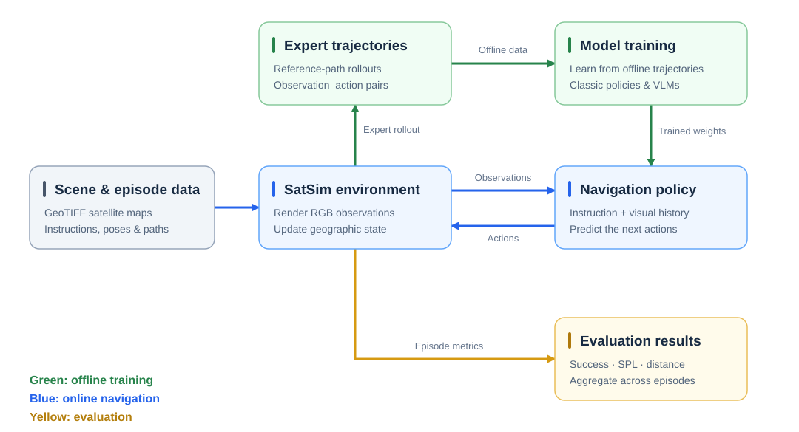

<h1 align="center">SatNav</h1>

<p align="center">
  <strong>
    SatNav: A Scalable Benchmark for Long-Horizon UAV Vision-Language Navigation from Satellite Imagery
  </strong>
</p>

<p align="center">
  <strong>NeurIPS 2026 E&amp;D</strong>
</p>

<p align="center">
  <a href="https://eku127.github.io/">Jiajun Jiang</a><sup>1,*</sup> &nbsp; <a href="mailto:chua183@connect.hkust-gz.edu.cn">Chunliang Hua</a><sup>1,*</sup> &nbsp;
  <a href="mailto:chenzichun@idea.edu.cn">Zichun Chen</a><sup>2</sup> &nbsp; <a href="mailto:wuyanxing@idea.edu.cn">Yanxing Wu</a><sup>2</sup><br>
  <a href="mailto:yangzeyuan@idea.edu.cn">Zeyuan Yang</a><sup>2</sup> &nbsp; <a href="https://facultyprofiles.hkust-gz.edu.cn/faculty-personal-page/SONG-Jie/jsongroas">Jie Song</a><sup>1,3</sup> &nbsp;
  <a href="https://github.com/xiahaa">Xiao Hu</a><sup>1,2,†</sup>
</p>

<p align="center">
  <sup>1</sup> HKUST(GZ) &nbsp;&nbsp;
  <sup>2</sup> LASER, IDEA &nbsp;&nbsp;
  <sup>3</sup> HKUST
</p>

<p align="center">
  <a href="https://openreview.net/forum?id=hOEniyN6hl"></a>
  <a href="https://eku127.github.io/SatNav/wiki/"></a>
  <a href="https://huggingface.co/datasets/Eku127/SatNav-Episodes-v0.1"></a>
  <a href="https://huggingface.co/collections/Eku127/satnav-baseline-model-zoo"></a>
</p>

<p align="center">
  <a href="docs/en-US/README.md">English</a> &nbsp;|&nbsp;
  <a href="docs/zh-CN/README.md">简体中文</a>
</p>

<p align="center">
  <a href="docs/assets/readme/overview-final.png">
    
  </a>
</p>

<p align="center">
  <em>Follow boundaries, navigate between landmarks, and trace routes through satellite scenes.</em>
</p>

SatNav brings scene preparation, trajectory generation, model training, and online evaluation into one navigation platform. At its core, **SatSim** renders RGB observations from local GeoTIFF scenes as agents move through continuous geographic space with longitude, latitude, altitude, and heading.


## Quick Start

**Run your first episode with the bundled synthetic scene.** The example includes its own map and episodes, so you can start without downloading the full dataset or a model checkpoint.

Create the core environment and install SatNav:

```bash
git clone https://github.com/Eku127/SatNav.git
cd SatNav

conda env create -f environments/satnav/conda.yml
conda activate satnav
python -m pip install -e .
```

Run the reference path follower:

```bash
python examples/reference_follower_example.py
```

The example follows a recorded path, prints navigation metrics, and saves the final RGB observation and top-down trajectory map to `output/examples/reference_follower/`.

Continue with the [installation guide](docs/en-US/getting-started/INSTALLATION.md) or explore [more examples](docs/en-US/getting-started/EXAMPLES.md), including multi-episode navigation and video output.

## From satellite maps to navigation evaluation

[](docs/assets/readme/workflow.svg)

Start with local scenes and episodes, generate training trajectories, and evaluate a policy through the same environment interface. The viewer lets you inspect instructions, RGB observations, and map trajectories together.

[Watch a Path Follower episode](docs/assets/examples/episode_1602_video.mp4) · [Open the viewer guide](docs/en-US/applications/VIEWER.md)

## Dataset & Model Zoo

**[SatNav-Episodes-v0.1](https://huggingface.co/datasets/Eku127/SatNav-Episodes-v0.1)** provides **118,494 VLN episodes across 59 scenes**, covering boundary, landmark, and route navigation. Each episode pairs a language instruction with a scene, starting pose, goals, waypoints, and a reference path. The release includes `train`, `val_seen`, and `val_unseen` splits.

Use the JSON files under `episodes/` with SatNav, or explore the same annotations through the Hugging Face Dataset Viewer and Parquet files under `data/`. Prepare the corresponding GeoTIFF scenes with the map tools below.

| Resource | Where to start |
| --- | --- |
| Episodes and splits | [Download on Hugging Face](https://huggingface.co/datasets/Eku127/SatNav-Episodes-v0.1/tree/main/episodes) |
| Dataset preview and loading | [Dataset Card](https://huggingface.co/datasets/Eku127/SatNav-Episodes-v0.1) |
| Satellite scenes | [Prepare GeoTIFF maps](docs/en-US/applications/MAP_DOWNLOAD.md) |
| Training trajectories | [Generate observation-action data](docs/en-US/applications/TRAJECTORY_GENERATION.md) |
| Episode format | [Read the dataset specification](docs/en-US/dataset/DATASET_FORMAT.md) |
| Released VLM checkpoints | [Browse the SatNav Model Zoo](https://huggingface.co/collections/Eku127/satnav-baseline-model-zoo) |

## Baselines

SatNav supports classic navigation policies and four VLM integrations. Each uses the shared online evaluation interface.

| Model | Training | Evaluation | Checkpoints | Ref |
| --- | --- | --- | --- | --- |
| Seq2Seq | [Guide](docs/en-US/training/CLASSIC.md#5-train-seq2seq) | [Guide](docs/en-US/training/CLASSIC.md#8-configure-shared-evaluation) | [Use training outputs](docs/en-US/training/CLASSIC.md#7-checkpoints-and-continued-training) | [GitHub](https://github.com/jacobkrantz/VLN-CE) |
| CMA | [Guide](docs/en-US/training/CLASSIC.md#6-train-cma) | [Guide](docs/en-US/training/CLASSIC.md#8-configure-shared-evaluation) | [Use training outputs](docs/en-US/training/CLASSIC.md#7-checkpoints-and-continued-training) | [GitHub](https://github.com/jacobkrantz/VLN-CE) |
| StreamVLN | [Guide](docs/en-US/training/vlm/STREAMVLN.md#9-full-training) | [Guide](docs/en-US/training/vlm/STREAMVLN.md#10-configure-online-evaluation) | [Download](docs/en-US/training/vlm/STREAMVLN.md#51-released-satnav-checkpoints) | [GitHub](https://github.com/InternRobotics/StreamVLN) |
| NaVILA | [Guide](docs/en-US/training/vlm/NAVILA.md#9-full-training) | [Guide](docs/en-US/training/vlm/NAVILA.md#10-configure-online-evaluation) | [Download](docs/en-US/training/vlm/NAVILA.md#51-released-satnav-checkpoints) | [GitHub](https://github.com/AnjieCheng/NaVILA) |
| Uni-NaVid | [Guide](docs/en-US/training/vlm/UNINAVID.md#9-full-training-and-resume) | [Guide](docs/en-US/training/vlm/UNINAVID.md#10-configure-online-evaluation) | [Download](docs/en-US/training/vlm/UNINAVID.md#51-released-satnav-checkpoints) | [GitHub](https://github.com/jzhzhang/Uni-NaVid) |
| OpenFly | [Guide](docs/en-US/training/vlm/OPENFLY.md#9-full-training-and-resume) | [Guide](docs/en-US/training/vlm/OPENFLY.md#10-configure-online-evaluation) | [Download](docs/en-US/training/vlm/OPENFLY.md#51-released-satnav-checkpoints) | [GitHub](https://github.com/SHAILAB-IPEC/OpenFly-Platform) |
| SwiftVLN | — | — | — | [GitHub](https://github.com/Eku127/SwiftVLN) |

For SwiftVLN setup on SatNav, see the [SwiftVLN repository](https://github.com/Eku127/SwiftVLN).

**Random** and **ReferenceFollower** are also available as lightweight baselines; see the [classic baseline guide](docs/en-US/training/CLASSIC.md).

Each VLM has its own environment to accommodate its PyTorch, Transformers, and FlashAttention dependencies. Follow the model's setup guide before training or evaluation.


## Documentation

| I want to… | Guide |
| --- | --- |
| Install SatNav and run an example | [Installation](docs/en-US/getting-started/INSTALLATION.md) · [Examples](docs/en-US/getting-started/EXAMPLES.md) |
| Explore maps and navigation episodes | [SatSim Viewer](docs/en-US/applications/VIEWER.md) |
| Work with the environment API | [Core API](docs/en-US/core/CORE_API.md) |
| Train or evaluate a policy | [Training](docs/en-US/training/README.md) · [Evaluation](docs/en-US/evaluation/README.md) |
| Bring my own navigation model | [Model Integration](docs/en-US/development/MODEL_INTEGRATION.md) |

Browse the complete documentation in [English](docs/en-US/README.md) or [简体中文](docs/zh-CN/README.md).

<details>
<summary><strong>Repository structure</strong></summary>

```text
satnav/       Core environment, dataset, simulator, task, and evaluation APIs
configs/      Public task and baseline configurations
applications/ Map, episode, trajectory, and viewer tools
baselines/    Classic and VLM integrations
examples/     Runnable examples using bundled synthetic resources
scripts/      Training, evaluation, validation, and utility entry points
docs/         English and Chinese documentation
```

</details>

## License

SatNav source code is released under the [MIT License](LICENSE). Dataset, documentation, map content, and third-party components may use different terms; see [DATA_LICENSE.md](DATA_LICENSE.md) and [NOTICE](NOTICE).

## Acknowledgements

SatNav's architecture is inspired by [VLN-CE](https://github.com/jacobkrantz/VLN-CE) and [Habitat-Lab](https://github.com/facebookresearch/habitat-lab).

We thank the teams behind [StreamVLN](https://github.com/InternRobotics/StreamVLN), [NaVILA](https://github.com/AnjieCheng/NaVILA), [Uni-NaVid](https://github.com/jzhzhang/Uni-NaVid), and [OpenFly](https://github.com/SHAILAB-IPEC/OpenFly-Platform) for sharing their methods and implementations. StreamVLN's training-data processing and trajectory-adaptation design provided valuable inspiration for SatNav.
