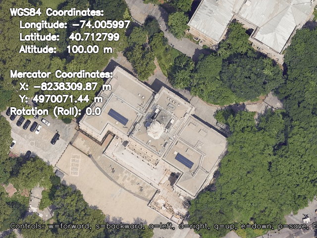
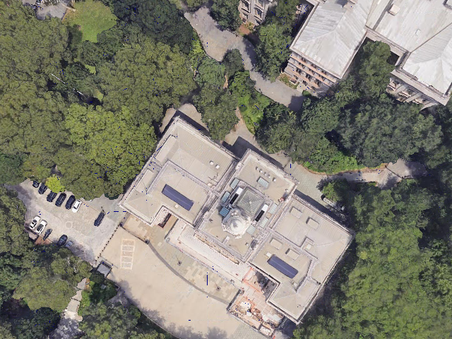

# SatNav: 连续状态 VLN 评测平台

## 项目简介

SatNav 是一个用于评测连续状态下视觉语言导航（VLN）的测试平台。该平台使用卫星地图作为场景，支持基于地理坐标（经度、纬度、高度）的连续空间导航，并通过自定义的 **SatSim 卫星地图仿真器**实现场景渲染和动作执行。

**核心特点**：
- 🌍 使用卫星地图作为场景（而非3D室内场景）
- 📍 位置使用地理坐标（经度、纬度、高度）
- 🧭 旋转使用roll角度（航向角，0度表示正北）
- 🖼️ 图像通过从卫星地图裁剪和旋转生成
- 🚀 最小化实现，不依赖 Habitat 组件

---

## 1. 环境安装

### 1.1 使用 Conda（推荐）

```bash
# 创建conda环境（Python 3.8+）
conda create -n satnav python=3.8
conda activate satnav

# 安装依赖
cd /path/to/SatNav
pip install -r requirements.txt

# 或者以开发模式安装
pip install -e .
```

### 1.2 使用 pip + venv

```bash
# 创建虚拟环境
python3 -m venv satnav_env
source satnav_env/bin/activate  # Linux/Mac
# 或
satnav_env\Scripts\activate  # Windows

# 安装依赖
cd /path/to/SatNav
pip install -r requirements.txt

# 或者以开发模式安装
pip install -e .
```

### 1.3 依赖说明

**核心依赖**：
- `numpy>=1.19.0` - 数值计算
- `omegaconf>=2.1.0` - 配置管理
- `pyyaml>=5.4.0` - YAML文件解析
- `attrs>=21.0.0` - 数据类支持

**SatSim 仿真器依赖**：
- `rasterio>=1.3.0` - TIF文件处理和重投影
- `pyproj>=3.4.0` - 坐标转换（WGS84 ↔ EPSG:3857）
- `scipy>=1.7.0` - 图像旋转
- `opencv-python>=4.5.0` - 图像缩放

**测试依赖**：
- `pytest>=7.0.0` - 测试框架
- `pytest-cov>=4.0.0` - 测试覆盖率

---

## 2. SatSim 仿真器工作原理

SatSim 是 SatNav 的核心仿真引擎，负责加载卫星地图、执行动作、生成观测。它采用**双坐标系统**设计，在内部使用 EPSG:3857（Web Mercator）进行高效计算，对外暴露 WGS84（经纬度）接口。

### 2.1 坐标系统

SatSim 使用两套坐标系统：

**外部接口（WGS84 - EPSG:4326）**：
- 输入/输出位置：`[longitude, latitude, altitude]`
- 经度/纬度：度数（-180 到 180，-90 到 90）
- 高度：米

**内部处理（Web Mercator - EPSG:3857）**：
- 位置：`[x, y]` 米为单位
- 优势：在局部区域内可以近似为平面，便于计算距离和移动

**坐标转换**：
- 使用 `pyproj` 库进行精确的坐标转换
- 所有转换在 `GeoUtils` 类中统一管理
- 转换发生在 SatSim 的边界层，对上层透明

### 2.2 场景加载

**场景文件格式**：
- 支持 GeoTIFF（.tif）格式的卫星地图
- 自动检测坐标系，如果不是 EPSG:3857，使用 `rasterio.WarpedVRT` 进行重投影
- 场景路径：`{SCENES_DIR}/{scene_id}.tif`

**加载策略**：
- **延迟加载**：场景在首次访问时加载（`reset()` 时）
- **LRU缓存**：使用 `@lru_cache` 缓存最近使用的5个场景
- **自动重投影**：非 EPSG:3857 的 TIF 文件自动重投影到 EPSG:3857

### 2.3 动作执行

SatSim 支持四种离散动作：

1. **MOVE_FORWARD**：向前移动 `FORWARD_STEP_SIZE` 米（默认 0.25m）
   - 在 Web Mercator 坐标系中计算新位置
   - 使用 `GeoUtils.move_in_mercator()` 根据当前航向角移动
   - 边界检查：如果新位置超出地图范围，则保持当前位置不变

2. **TURN_LEFT**：向左旋转 `TURN_ANGLE` 度（默认 15°）
   - 航向角减少，范围 [0, 360)

3. **TURN_RIGHT**：向右旋转 `TURN_ANGLE` 度（默认 15°）
   - 航向角增加，范围 [0, 360)

4. **STOP**：停止动作，不改变位置或旋转

### 2.4 图像渲染

SatSim 使用 `SatelliteCamera` 类生成 RGB 观测：

**渲染流程**：
1. **计算视野范围**：根据位置、高度、HFOV 和旋转角度计算地面覆盖范围
   - 水平半宽：`half_x_m = altitude * tan(HFOV / 2)`（HFOV控制水平方向）
   - 垂直半宽：`half_y_m = half_x_m / aspect_ratio`
   - 考虑旋转角度，计算四个角点的位置

2. **裁剪卫星地图**：使用 `rasterio.windows.from_bounds()` 从 TIF 文件中裁剪对应区域

3. **旋转图像**：使用 `scipy.ndimage.rotate()` 根据航向角旋转图像

4. **缩放图像**：使用 `cv2.resize()` 缩放到目标尺寸（默认 224x224）

5. **返回 RGB 数组**：形状为 `(H, W, 3)` 的 uint8 数组

**边界检查**：
- 如果相机视野超出地图边界，会抛出 `ValueError`
- 确保所有渲染的图像都完全在地图范围内

### 2.5 模块结构

SatSim 分为三个核心模块：

```
satnav/sims/satsim/
├── satsim.py      # 核心引擎：场景管理、动作执行、状态管理
├── camera.py      # 相机渲染：视野计算、图像裁剪/旋转/缩放
└── geoutils.py    # 坐标工具：WGS84 ↔ EPSG:3857 转换、移动计算
```

---

## 3. SatNav 架构解析

SatNav 采用分层架构设计，从上层到下层依次为：**Env** → **VLNTask** → **SatSimWrapper** → **SatSim**。

### 3.1 架构层次

```
┌─────────────────────────────────────────────────────────┐
│                    Env (环境层)                         │
│  - 管理 Episode 迭代                                    │
│  - 连接 Dataset、Simulator、Task                        │
│  - 提供统一的 reset() 和 step() 接口                    │
└────────────────────┬────────────────────────────────────┘
                     │
┌────────────────────▼────────────────────────────────────┐
│                 VLNTask (任务层)                        │
│  - 管理传感器（RGB、Instruction）                        │
│  - 管理评价指标（Success、SPL、DistanceToGoal等）        │
│  - 验证动作有效性                                        │
└────────────────────┬────────────────────────────────────┘
                     │
┌────────────────────▼────────────────────────────────────┐
│            SatSimWrapper (适配器层)                      │
│  - 适配 SatNav.core.Simulator 接口                      │
│  - 处理场景路径组合（SCENES_DIR + scene_id）             │
│  - 转换 WGS84 坐标（对上层透明）                         │
└────────────────────┬────────────────────────────────────┘
                     │
┌────────────────────▼────────────────────────────────────┐
│                SatSim (仿真器层)                         │
│  - 场景加载和缓存                                        │
│  - 动作执行（EPSG:3857 内部）                           │
│  - 图像渲染                                             │
└─────────────────────────────────────────────────────────┘
```

### 3.2 各层职责详解

#### **Env 层（环境层）**

**职责**：
- 管理 Episode 生命周期（从 Dataset 获取、迭代）
- 协调 Dataset、Simulator、Task 三个组件
- 提供标准的 RL 环境接口：`reset()` 和 `step(action)`

**关键方法**：
- `reset()`: 获取下一个 episode，重置 simulator 和 task，返回初始观测
- `step(action)`: 执行动作，更新状态，返回 (obs, done, info)
- `get_metrics()`: 获取当前评价指标

**数据流**：
```
reset() → 获取 episode → task.reset() → sim.reset() → 返回观测
step() → task.step() → sim.step() → 更新指标 → 返回观测
```

#### **VLNTask 层（任务层）**

**职责**：
- 管理传感器：RGB（从 Simulator 获取）、Instruction（从 Episode 获取）
- 管理评价指标：Success、SPL、DistanceToGoal、PathLength
- 验证动作是否在允许的动作列表中

**传感器**：
- `RGBSensor`: 从 `simulator.get_observations()["rgb"]` 获取图像
- `InstructionSensor`: 从 `episode.instruction.instruction_text` 获取文本

**评价指标**：
- `DistanceToGoal`: 使用 `simulator.geodesic_distance()` 计算到目标的测地距离
- `Success`: 当调用 STOP 且距离目标 < SUCCESS_DISTANCE 时为 1.0
- `PathLength`: 累计路径长度（使用测地距离）
- `SPL`: Success weighted by Path Length

#### **SatSimWrapper 层（适配器层）**

**职责**：
- 实现 `SatNav.core.Simulator` 抽象接口
- 处理场景路径组合：`{SCENES_DIR}/{scene_id}.tif`
- 在 WGS84（外部）和 EPSG:3857（内部）之间转换坐标
- 委托所有核心功能给 `SatSim` 实例

**关键转换**：
- `set_agent_state(position_wgs84, rotation)`: 将 WGS84 位置转换为 EPSG:3857 后传给 SatSim
- `get_agent_state()`: 从 SatSim 获取 EPSG:3857 位置，转换为 WGS84 返回
- `geodesic_distance()`: 使用 `satnav.core.utils.geodesic_distance()` 计算测地距离

#### **SatSim 层（仿真器层）**

**职责**：
- 场景管理：加载、缓存、重投影 TIF 文件
- 动作执行：在 EPSG:3857 坐标系中执行移动和旋转
- 图像渲染：根据位置、高度、旋转生成 RGB 图像
- 边界检查：防止智能体移动到地图外

**内部状态**：
- `_agent_position`: `(x_mercator, y_mercator, altitude)` - EPSG:3857 坐标
- `_agent_rotation`: 航向角（度，0=正北）
- `_current_scene`: 当前加载的 rasterio DatasetReader

---

## 4. 配置和数据集

### 4.1 配置文件格式

SatNav 使用 YAML 格式的配置文件，示例：`configs/vln_task.yaml`

```yaml
ENVIRONMENT:
  # 每个 episode 的最大步数
  MAX_EPISODE_STEPS: 500

SIMULATOR:
  # 向前移动的步长（米）
  FORWARD_STEP_SIZE: 0.25
  # 转向角度（度）
  TURN_ANGLE: 15
  # RGB 传感器配置
  RGB_SENSOR:
    WIDTH: 224      # 图像宽度（像素）
    HEIGHT: 224     # 图像高度（像素）
    HFOV: 90        # 水平视野角度（度）

TASK:
  TYPE: VLN
  # 成功距离阈值（米）
  SUCCESS_DISTANCE: 3.0
  # 允许的动作列表
  POSSIBLE_ACTIONS: [STOP, MOVE_FORWARD, TURN_LEFT, TURN_RIGHT]
  # 启用的评价指标
  MEASUREMENTS: [DISTANCE_TO_GOAL, SUCCESS, SPL, PATH_LENGTH]

DATASET:
  TYPE: SatNav      # 仅用于标识，不影响实际加载
  SPLIT: train      # 数据集划分：train/val_seen/val_unseen/test
  # 数据集文件路径（支持 {split} 占位符）
  DATA_PATH: data/datasets/satnav/{split}/{split}.json.gz
  # 场景数据目录（TIF 文件所在目录）
  SCENES_DIR: data/scene_datasets/
```

### 4.2 数据集格式

SatNav 使用 JSON 格式的数据集文件（支持 `.json` 和 `.json.gz`），格式如下：

```json
{
  "instruction_vocab": {
    "word_list": ["go", "to", "the", "destination", ...]
  },
  "episodes": [
    {
      "episode_id": "example_001",
      "trajectory_id": "traj_001",
      "scene_id": "map",
      "start_position": [114.064413, 22.543496, 100.0],
      "start_rotation": 0.0,
      "goals": [
        {
          "position": [114.070413, 22.543496, 100.0]
        }
      ],
      "reference_path": [
        [114.064413, 22.543496, 100.0],
        [114.067413, 22.543496, 100.0],
        [114.070413, 22.543496, 100.0]
      ],
      "instruction": {
        "instruction_text": "Go east to the destination"
      }
    }
  ]
}
```

**字段说明**：
- `episode_id`: Episode 唯一标识符
- `scene_id`: 场景标识符，对应 `{SCENES_DIR}/{scene_id}.tif` 文件
- `start_position`: 起始位置 `[longitude, latitude, altitude]`
- `start_rotation`: 起始航向角（度，0=正北）
- `goals`: 目标位置列表（每个目标包含 `position`）
- `reference_path`: 参考路径（用于计算 SPL 等指标）
- `instruction`: 导航指令（包含 `instruction_text`）

### 4.3 场景文件

**场景文件要求**：
- 格式：GeoTIFF（.tif）
- 坐标系：建议使用 EPSG:3857，其他坐标系会自动重投影
- 位置：`{SCENES_DIR}/{scene_id}.tif`

**示例目录结构**：
```
data/
├── datasets/
│   └── satnav/
│       ├── train/
│       │   └── train.json.gz
│       └── val_seen/
│           └── val_seen.json.gz
└── scene_datasets/
    ├── map.tif
    └── scene_001.tif
```

---

## 5. 测试命令行

### 5.1 运行所有测试

```bash
# 确保在 conda 环境中
conda activate satnav

# 运行所有测试
pytest

# 运行所有测试（详细输出）
pytest -v

# 运行所有测试（显示覆盖率）
pytest --cov=satnav --cov-report=term-missing

# 运行所有测试（生成 HTML 覆盖率报告）
pytest --cov=satnav --cov-report=html
```

### 5.2 运行特定测试文件

```bash
# 配置加载测试
pytest tests/test_config.py -v

# 数据集加载测试
pytest tests/test_dataset.py -v

# 环境测试（包含集成测试）
pytest tests/test_env.py -v

# VLN 任务测试
pytest tests/test_vln_task.py -v

# SatSim 核心引擎测试
pytest tests/test_satsim.py -v

# 相机渲染测试
pytest tests/test_camera.py -v

# 坐标转换工具测试
pytest tests/test_geoutils.py -v

# 工具函数测试（测地距离）
pytest tests/test_utils.py -v
```

### 5.3 运行特定测试类或测试方法

```bash
# 运行特定测试类
pytest tests/test_env.py::TestEnvIntegration -v

# 运行特定测试方法
pytest tests/test_env.py::TestEnvIntegration::test_multiple_steps_with_real_satsim -v

# 运行多个测试方法（使用模式匹配）
pytest tests/test_env.py -k "test_metric" -v
```


---

## 6. 快速开始示例

SatNav 提供了两个完整的示例脚本，演示如何使用不同的路径跟随策略进行导航。

### 6.1 SatNavPathFollower 示例

`satnav_path_follower_example.py` 演示如何使用 `SatNavPathFollower` 运行数据集中的所有 episode。

**特点**：
- 使用贪心策略直接导航到目标位置
- 支持运行数据集中的所有 episode
- 为每个 episode 生成视频（可选）
- 生成包含所有 episode 评估指标的 JSON 文件

**使用方法**：
```bash
# 运行所有 episode 并生成视频（默认）
python examples/satnav_path_follower_example.py

# 运行所有 episode 但不生成视频
python examples/satnav_path_follower_example.py --no-video
```

**输出**：
- 每个 episode 的视频：`output/episode_{episode_id}_video.mp4`
- 评估结果 JSON：`output/{dataset_name}_{timestamp}.json`
- 最终可视化图像：`output/topdown_map_satnav_follower.png`

**JSON 结果文件格式**：
```json
{
  "dataset_name": "satnav_dataset_complex",
  "timestamp": "20251202_151823",
  "total_episodes": 2,
  "summary": {
    "successful_episodes": 2,
    "success_rate": 1.0,
    "average_success": 1.0,
    "average_spl": 0.95,
    "average_steps": 45.5
  },
  "episodes": [
    {
      "episode_id": "complex_path_001",
      "scene_id": "map",
      "instruction": "Go forward, then turn left...",
      "success": 1.0,
      "spl": 0.95,
      "distance_to_goal": 0.5,
      "path_length": 120.5,
      "reference_path_length": 127.0,
      "path_efficiency": 0.95,
      "num_steps": 42,
      "action_distribution": {"MOVE_FORWARD": 30, "TURN_LEFT": 8, "TURN_RIGHT": 4}
    }
  ]
}
```

### 6.2 ReferencePathFollower 示例

`reference_follower_example.py` 演示如何使用 `ReferencePathFollower` 运行单个 episode。

**特点**：
- 沿着参考路径的 waypoint 顺序导航
- 严格遵循数据集中的参考路径
- 适用于生成 teacher forcing 数据和评估路径跟随精度
- 简洁的实现，专注于核心导航逻辑

**使用方法**：
```bash
python examples/reference_follower_example.py
```

**输出**：
- 最终可视化图像：`output/topdown_map_example.png`
- 控制台输出评估指标

### 6.3 基本使用（编程接口）

如果需要自定义导航策略，可以直接使用 SatNav 的编程接口：

```python
from satnav.core import Env
from satnav.core.config import load_config

# 加载配置
config = load_config("configs/vln_task.yaml")

# 创建环境
env = Env(config)

# 运行一个 episode
obs = env.reset()
done = False
step_count = 0

while not done and step_count < 100:
    # 随机选择动作（实际应用中应该使用策略网络）
    action = env.action_space.sample()
    
    # 执行动作
    obs, done, info = env.step(action)
    step_count += 1
    
    # 打印当前状态
    state = env._task._sim.get_agent_state()
    print(f"Step {step_count}: Position={state.position}, Rotation={state.rotation}")

# 获取评价指标
metrics = env.get_metrics()
print(f"\nEpisode finished!")
print(f"Success: {metrics['success']}")
print(f"SPL: {metrics['spl']}")
print(f"Distance to goal: {metrics['distance_to_goal']:.2f}m")
print(f"Path length: {metrics['path_length']:.2f}m")
```

### 6.4 验证安装

```bash
# 验证导入
python3 -c "from satnav.core import Env; from satnav.sims.satsim import SatSim; print('✓ Installation successful')"

# 运行示例
python examples/satnav_path_follower_example.py --no-video
python examples/reference_follower_example.py
```

---

## 7. 应用工具

SatNav 提供了多个实用工具应用，位于 `applications/` 目录下：

### 7.1 SatSim Viewer（交互式查看器）

`applications/satsim_viewer/` 目录包含两个交互式查看器应用：

#### 7.1.1 Free Viewer（自由探索查看器）

用于自由探索卫星地图的工具，支持键盘控制导航。

**快速开始**：
```bash
# 使用 -m 模块方式（默认运行 free viewer）
python -m applications.satsim_viewer
python -m applications.satsim_viewer free

# 或直接运行
python -m applications.satsim_viewer.free_viewer
```

**控制方式**：
- `w`: 向前移动
- `s`: 向后移动
- `a`: 向左转
- `d`: 向右转
- `q`: 上升（增加高度）
- `e`: 下降（减少高度）
- `p`: 保存当前图像
- `ESC`: 退出

**配置**：编辑 `applications/satsim_viewer/config.yaml` 设置 TIF 文件路径、相机参数等。

#### 7.1.2 Task Viewer（任务查看器）

用于交互式浏览 VLN 任务的工具，支持键盘控制导航和任务评估。

**快速开始**：
```bash
# 使用 -m 模块方式
python -m applications.satsim_viewer task

# 或直接运行
python -m applications.satsim_viewer.task_viewer
```

**控制方式**：
- `w`: 向前移动
- `a`: 向左转
- `d`: 向右转
- `t`: 切换 topdown 视图
- `SPACE`: 停止并显示评估指标，然后加载下一个 episode
- `ESC`: 退出

**配置**：使用 VLN 任务配置文件（如 `configs/vln_task.yaml`）。

详细文档：`applications/satsim_viewer/README.md`

### 7.2 Map Downloader（地图下载器）

从 Google Maps Static API 下载卫星图像并生成 GeoTIFF 文件的工具。

**快速开始**：
```bash
# 编辑 config.yaml 设置区域和 API key
python -m applications.map_downloader
```

**主要功能**：
- 支持角点定义或中心点+尺寸两种区域定义方式
- 支持顺序和并行两种下载模式（并行模式 4-9 倍速度提升）
- 自动生成带地理参考的 GeoTIFF 文件（EPSG:3857）

**配置**：编辑 `applications/map_downloader/config.yaml` 设置：
- `REGION`: 区域定义（角点或中心点）
- `API.API_KEY`: Google Maps API key
- `DOWNLOAD.MODE`: 下载模式（`sequential` 或 `parallel`）
- `DOWNLOAD.ZOOM`: 缩放级别（15-20）

详细文档：`applications/map_downloader/README.md`

### 7.3 Aerial Viewer（3D 航拍查看器）

使用 CesiumJS 和 Google 3D Tiles 渲染非交互式 3D 航拍视图的工具，与 SatSim 相机模型兼容。

**快速开始**：
```bash
python -m applications.aerial_viewer
```

**主要功能**：
- 渲染 3D 航拍视图（使用 Google 3D Tiles）
- 与 SatSim 相机参数兼容（垂直俯视、HFOV 匹配）
- 支持多种浏览器（Chrome、Edge、Firefox）
- 命令行接口和配置文件支持

**示例输出对比**：

<div style="display: flex; gap: 20px; align-items: center;">
  <div style="flex: 1;">
    <p><strong>SatSim 卫星视图（2D 正交投影）</strong></p>
    
  </div>
  <div style="flex: 1;">
    <p><strong>Aerial Viewer 3D 视图（3D 透视投影）</strong></p>
    
  </div>
</div>

**配置**：编辑 `applications/aerial_viewer/config.yaml` 设置：
- `API.API_KEY`: Google 3D Tiles API key
- `AGENT`: 智能体状态（经纬度、高度、旋转角度）
- `CAMERA`: 相机参数（HFOV、宽度、高度）

**与 SatSim 的区别**：
- **投影模型**：SatSim 使用正交投影（无透视变形），Aerial Viewer 使用透视投影（3D 渲染）
- **地形**：SatSim 使用 2D 卫星图像（平面），Aerial Viewer 使用 3D Tiles（包含建筑物高度和地形）
- **图像来源**：SatSim 使用高分辨率 GeoTIFF 文件，Aerial Viewer 使用 Google 3D Tiles（流式传输）

**依赖要求**：
- `selenium` - WebDriver 控制
- `omegaconf` - 配置管理
- `webdriver-manager`（推荐）- 自动管理浏览器驱动
- Google 3D Tiles API key

详细文档：`applications/aerial_viewer/README.md`

---

## 8. 项目结构

```
SatNav/
├── satnav/                    # 主包
│   ├── core/                 # 核心组件
│   │   ├── env.py           # 环境类
│   │   ├── simulator.py     # 仿真器接口
│   │   ├── episode.py        # Episode数据定义
│   │   ├── config.py         # 配置系统
│   │   └── utils.py          # 工具函数（测地距离等）
│   ├── task/                 # VLN任务
│   │   ├── vln_task.py       # VLN任务类
│   │   ├── sensors.py        # 传感器
│   │   ├── actions.py        # 动作定义
│   │   └── measures.py       # 评价指标
│   ├── dataset/              # 数据集
│   │   └── satnav_dataset.py  # SatNav数据集加载器
│   └── sims/                 # 仿真器
│       ├── satsim_wrapper.py # SatSim适配器
│       └── satsim/           # SatSim核心模块
│           ├── __init__.py
│           ├── satsim.py     # 核心引擎
│           ├── camera.py     # 相机渲染
│           └── geoutils.py   # 坐标工具
├── configs/                   # 配置文件
│   └── vln_task.yaml         # VLN任务配置
├── examples/                  # 示例代码
│   ├── satnav_path_follower_example.py  # SatNavPathFollower 示例（批量运行）
│   └── reference_follower_example.py    # ReferencePathFollower 示例（单 episode）
├── tests/                     # 测试文件
│   ├── test_data/            # 测试数据
│   │   ├── map.tif           # 测试用卫星地图
│   │   ├── satnav_dataset_example.json
│   │   └── satnav_config_example.yaml
│   ├── test_config.py
│   ├── test_dataset.py
│   ├── test_env.py
│   ├── test_satsim.py
│   ├── test_camera.py
│   └── test_geoutils.py
├── applications/             # 应用工具
│   ├── satsim_viewer/       # 交互式查看器
│   │   ├── free_viewer.py   # 自由探索查看器
│   │   └── task_viewer.py   # 任务查看器
│   ├── aerial_viewer/        # 3D 航拍查看器
│   └── map_downloader/      # 地图下载器
├── doc/                      # 文档目录
│   └── refactor/             # 设计文档
├── setup.py                  # 安装脚本
├── requirements.txt          # 依赖列表
└── README.md                 # 本文件
```

---

## 9. 许可证

MIT License
