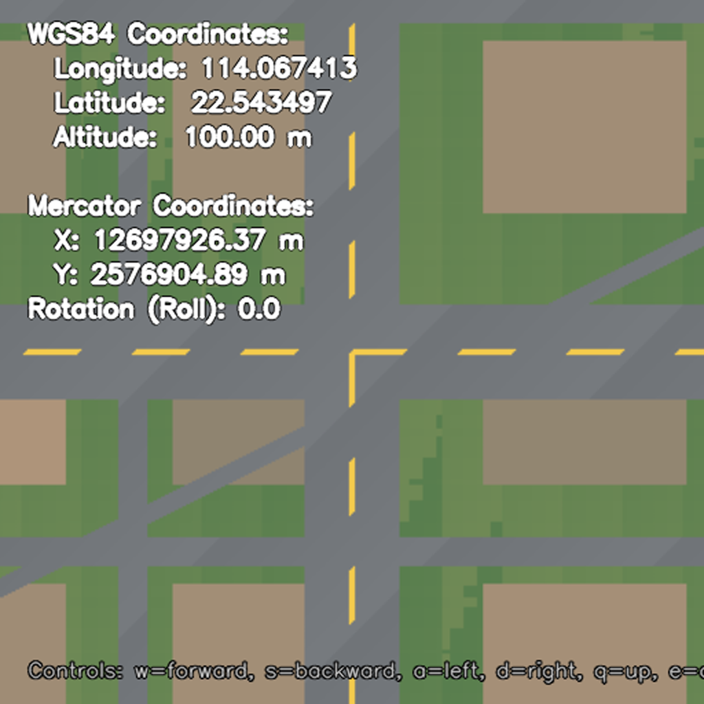
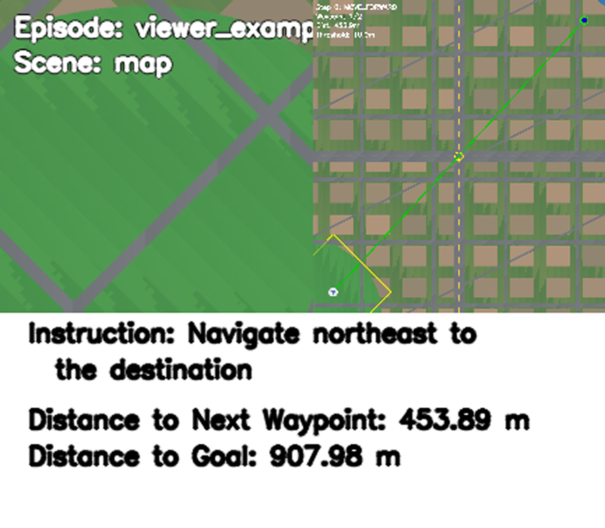
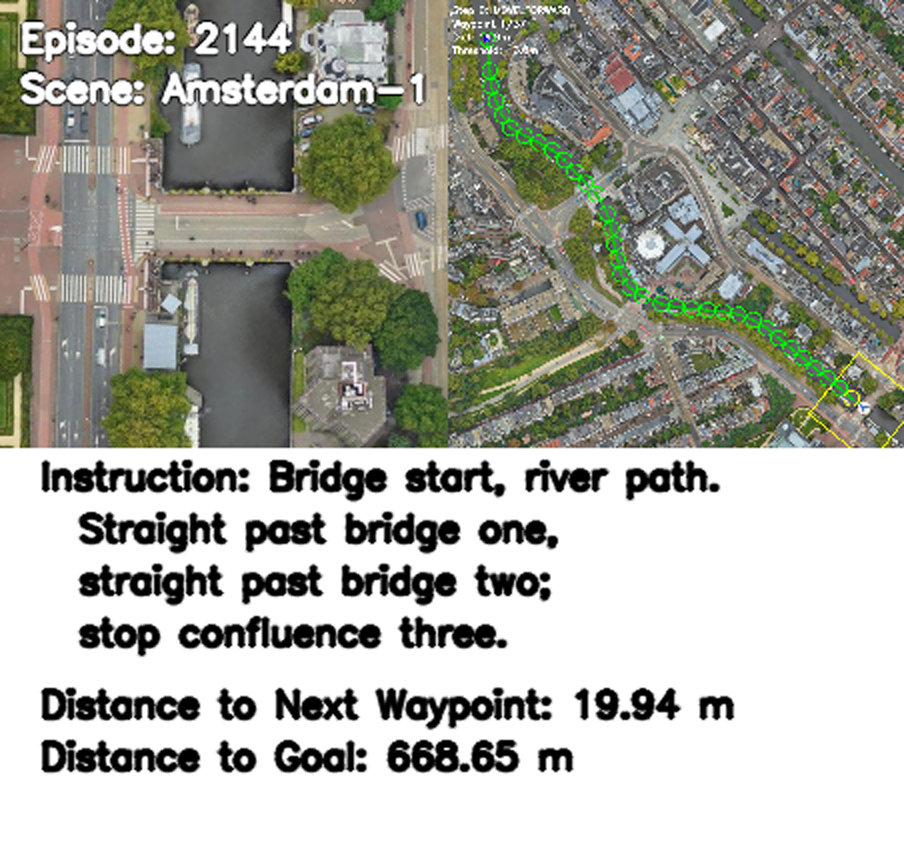

# SatSim Viewer

Use `applications/satsim_viewer` to inspect GeoTIFF scenes and SatNav VLN
episodes interactively. Task mode supports both SatSim and external simulator
classes.

| Mode | Purpose |
| --- | --- |
| `free` | Move freely in one GeoTIFF and inspect coordinates, heading, and altitude |
| `task` | Inspect RGB, instructions, waypoints, top-down maps, and metrics by episode |

## 1. Prepare the environment

Complete [Installation](../getting-started/INSTALLATION.md). Real scenes and
episodes also require [Episode Download](../dataset/DATA_DOWNLOAD.md) and
[Satellite Scene Download](MAP_DOWNLOAD.md).

```bash
python -m pip install -e '.[applications]'
```

> The viewer opens an OpenCV window and requires a graphical desktop. Over
> SSH, configure X11 forwarding and a valid `DISPLAY`.

## 2. Run the bundled examples

The repository includes a synthetic GeoTIFF and two episodes.

Free scene navigation:

```bash
python -m applications.satsim_viewer free
```



*Free viewer renders the synthetic GeoTIFF and displays WGS84, Web Mercator,
camera altitude, and heading.*

View VLN episodes:

```bash
python -m applications.satsim_viewer task
```

Automatically execute the episode reference path:

```bash
python -m applications.satsim_viewer task \
  --config applications/resources/satnav_example_task.yaml \
  --autoplay-reference
```



*Task viewer shows RGB on the left; agent, waypoint, and reference path on the
right; and instruction and distance below.*

With no mode, the command defaults to `free`:

```bash
python -m applications.satsim_viewer
```

## 3. Inspect a custom GeoTIFF

Copy the free-viewer configuration to an ignored local file:

```bash
mkdir -p .local
cp applications/satsim_viewer/config.yaml .local/satsim_viewer_free.yaml
```

Set `TIF_PATH` and adjust movement, camera, or initial altitude as needed:

```yaml
TIF_PATH: /absolute/path/to/Geneva-1.tif

SIMULATOR:
  FORWARD_STEP_SIZE: 30
  TURN_ANGLE: 15
  RGB_SENSOR:
    WIDTH: 512
    HEIGHT: 512
    HFOV: 90

AGENT:
  ALTITUDE: 100.0
  ROTATION: 0.0
  ALTITUDE_STEP_SIZE: 10.0
```

```bash
python -m applications.satsim_viewer free \
  --config .local/satsim_viewer_free.yaml
```

Free viewer starts at the scene center and displays both WGS84 and Web
Mercator coordinates.

## 4. Inspect real episodes

Configure paths:

```bash
export SATNAV_DATA_ROOT="$PWD/data/satnav_datasets/SatNav-v0.1"
export SATNAV_SCENES_DIR="$PWD/data/satnav_datasets/scenes"
export SATNAV_EPISODES_PATH="$SATNAV_DATA_ROOT/episodes/train/all_episodes.json"
```

Copy the example task configuration:

```bash
mkdir -p .local
cp applications/resources/satnav_example_task.yaml \
  .local/satsim_viewer_task.yaml
```

Replace its `DATASET` block with:

```yaml
DATASET:
  TYPE: SatNav
  SPLIT: train
  DATA_PATH: ${oc.env:SATNAV_EPISODES_PATH}
  SCENES_DIR: ${oc.env:SATNAV_SCENES_DIR}
```

Then run:

```bash
python -m applications.satsim_viewer task \
  --config .local/satsim_viewer_task.yaml
```



*Amsterdam-1 episode 2144: current RGB on the left, full reference path and
waypoint on the right, and the instruction below.*

Scene files must be named `<scene_id>.tif`. Task viewer displays the current
instruction, distance, RGB, and top-down map. After `STOP`, it shows Success,
SPL, Distance to Goal, and Path Length before loading the next episode.

### Top-down compatibility

Use `--topdown auto|satellite|vector|off`. The default `auto` mode retains the
original GeoTIFF-backed `TOP_DOWN_MAP` for SatSim and selects a local vector
path view for external simulators. The vector view draws the reference path,
executed path, current waypoint radius, and agent heading without accessing
SatSim private state. It is a debug visualization and is not rendered or
satellite imagery. `--no-topdown` aliases `--topdown off`.

## 5. Keyboard controls

### Free viewer

| Key | Action |
| --- | --- |
| `W` / `S` | Move forward / backward |
| `A` / `D` | Turn left / right |
| `Q` / `E` | Raise / lower camera altitude |
| `P` | Save the current view |
| `Esc` | Exit |

### Task viewer

| Key | Action |
| --- | --- |
| `W` | Move forward |
| `A` / `D` | Turn left / right |
| `T` | Toggle the top-down map |
| `P` | Pause/resume reference autoplay when enabled |
| `N` | Execute one reference action while autoplay is paused |
| `Space` | Execute `STOP` and show episode metrics |
| `Esc` | Exit |

Keyboard input targets the OpenCV window. Click the window first if keys do
not respond.

## 6. Screenshots

Press `P` in free viewer to write a PNG with coordinates and state to the
repository `output/` directory. The filename includes timestamp, coordinates,
altitude, and heading. `output/` is ignored by Git.

## 7. Troubleshooting

### Why can OpenCV not open a window?

The viewer needs a graphical desktop. Over SSH, configure X11 forwarding and
`DISPLAY`. Headless compute nodes cannot show the interactive window directly.

### Why do I get `TIF file not found`?

Verify the GeoTIFF path in the viewer config. Machine-local paths belong in a
local config or CLI argument, not a public configuration.

### Why can the agent not move farther?

The camera footprint may be near the scene boundary. Change direction or lower
the altitude so the rotated view remains within the GeoTIFF bounds.

### Why is the initial view outside the scene?

Lower `AGENT.ALTITUDE` or use a larger GeoTIFF. Higher altitude requires a
larger ground footprint.

### Why can Task viewer not find an episode scene?

`SCENES_DIR` must contain a GeoTIFF named for the logical `scene_id`, for
example `Amsterdam-1.tif` for `scene_id: Amsterdam-1`.

External simulators should use the default `--topdown auto` or explicit
`--topdown vector`. They do not need `SCENES_DIR` or a GeoTIFF for the debug
path panel.

SatSim stores agent state in WGS84 and renders observations from EPSG:3857
GeoTIFFs.
