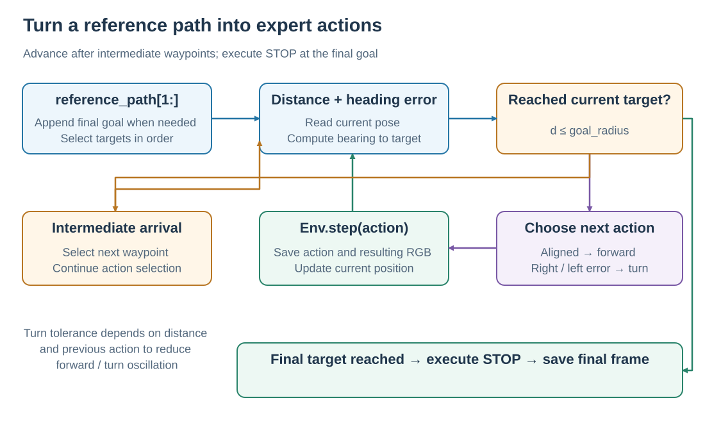
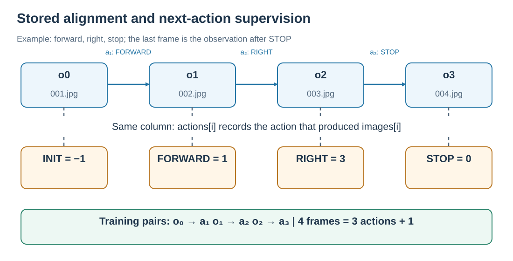

# From reference paths to expert training trajectories

Expert trajectories convert geographic reference routes into images, instructions, and actions for training. The generator loads an Episode and GeoTIFF, follows the route, saves RGB and actions after each environment interaction, and exports `annotations.json` plus frame directories. Commands are in the [trajectory generation guide](../applications/TRAJECTORY_GENERATION.md).

## 1. Selecting navigation targets

The generator follows `reference_path[1:]` in order; environment reset establishes the start state. If this sequence is empty or its last point differs from the Episode's first goal, that goal is appended. SatSim maintains position, altitude, and heading.



<p class="figure-caption" align="center"><em>Reaching an intermediate target advances the waypoint index; reaching the final target executes STOP. The environment configuration sets the step limit.</em></p>

Both serial and parallel production use `SatNavPathFollower` to choose the next action toward the current target. `ReferencePathFollower` packages multi-waypoint following as a separate helper; see the [examples](../getting-started/EXAMPLES.md).

## 2. Choosing forward and turn actions

For current heading $\theta$ and geographic bearing $b$ toward the target, normalize the heading error:

$$
\Delta\theta=\mathrm{wrap}_{[-180°,180°)}(b-\theta).
$$

The follower first measures geographic distance $d$:

| Condition | Returned action |
| --- | --- |
| $d\le r$: inside the target arrival radius | `STOP`, allowing the generator to handle target switching |
| $d>r$ and $|\Delta\theta|\le\tau$ | `MOVE_FORWARD` |
| Outside turn tolerance and $\Delta\theta>0$ | `TURN_RIGHT` |
| Outside turn tolerance and $\Delta\theta<0$ | `TURN_LEFT` |

The standard turn increment is $\beta=15°$. Normally, tolerance is $\tau=\beta/2=7.5°$; within distance $2r$, it increases to $\beta$. If the previous action was forward, tolerance is multiplied by 1.5, capped at $1.5\beta$. This reduces repeated forward/turn switching near a target or during continued forward movement.

At an intermediate target, the generator advances the waypoint index and continues selecting actions: the internal `STOP` indicates arrival at that waypoint. At the final target, it calls `Env.step(STOP)`, ends the episode, and saves the final observation.

## 3. Aligning images and actions



<p class="figure-caption" align="center"><em>The orange row is the stored action array; the blue row is the image sequence. Next-action supervision predicts the subsequent action from the preceding observation.</em></p>

Let $o_0$ be the initial observation after reset, and $a_1$ the first action producing $o_1$. Storage uses:

```text
images:   [o0,   o1, o2, ..., oT]
actions:  [INIT, a1, a2, ..., aT]
```

Here `INIT=-1` and `aT=STOP`. At the same index, `actions[i]` records the action that produced `images[i]`. A next-action training example therefore pairs $o_{i-1}$ with $a_i$. Action-chunk supervision takes the subsequent sequence of expert actions after the current observation.

For `actions=[-1,1,3,0]`, the four frames are the initial observation, post-forward observation, post-right-turn observation, and post-STOP observation; `steps=3`. The last two frames can have identical RGB because STOP preserves pose.

$$
N_{\mathrm{JPEG}}=\mathrm{len(actions)}=\mathrm{steps}+1.
$$

See [data format](../dataset/DATASET_FORMAT.md) for action IDs, annotation fields, and directories.

## 4. Why store offline trajectories

Rendering and expert following happen during data production. Trainers can read JPEGs and actions directly, resample trajectories, construct different history windows, and train different models on shared expert behavior.

Classic models learn stepwise action classification. VLMs convert actions or action chunks into text supervision. Each model handles its own image preprocessing, history sampling, and text template. During online evaluation, subsequent observations follow the model's executed actions, forming the [navigation loop](OVERVIEW.md).

## 5. Batch generation and resume

Parallel generation groups tasks by scene so workers can reuse open GeoTIFFs. Each worker owns an environment and follower and saves images, annotation data, and a completion marker when an episode completes.

On resume, the generator checks Episode content, generation settings, scene identity, and frame completeness. Matching artifacts are reused; episodes requiring regeneration restart from their initial state. The final public `annotations.json` collects the training annotations.

Production settings use 448 × 448 RGB, 90° HFOV, 10 m forward steps, 15° turns, and at most 500 steps. See [tasks and metrics](TASKS_AND_METRICS.md) for waypoint and evaluation radii.

Implementation: [`SatNavPathFollower`](../../../satnav/navigation/path_follower.py), [`serial generation`](../../../applications/trajectory_generation/runner.py), [`parallel generation`](../../../applications/trajectory_generation/generate_parallel.py), and [`artifact/cache validation`](../../../applications/trajectory_generation/utils.py).
