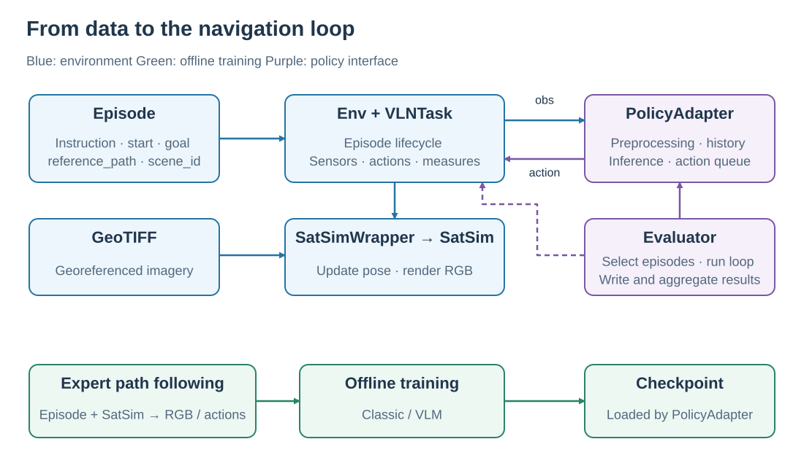
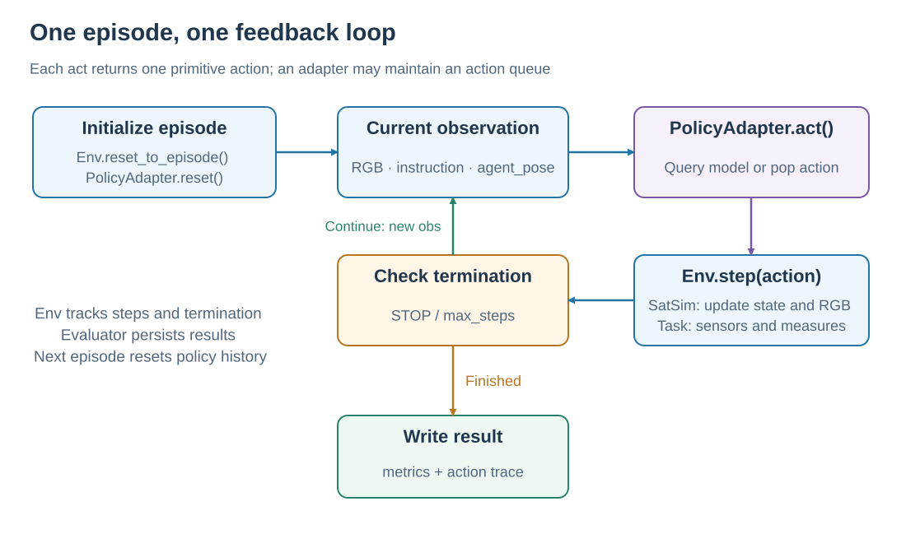

# SatNav architecture and navigation loop

SatNav connects a language navigation task to a satellite scene, a policy, and evaluation metrics. An Episode describes the task. SatSim renders RGB from the agent pose, the policy returns an action, and the environment produces the next observation. This loop runs until the policy stops or a step limit is reached.

Read this page, [SatSim observations](SATSIM.md), [tasks and metrics](TASKS_AND_METRICS.md), and [expert trajectories](EXPERT_TRAJECTORIES.md) in order. To run an episode, start with the [examples](../getting-started/EXAMPLES.md).

## 1. Components and responsibilities

<em>The environment and policy form the online loop. Expert path following uses the same environment to produce offline training data.</em>

| Component | Input | Responsibility |
| --- | --- | --- |
| `SatNavDataset` / `VLNEpisode` | Episode JSON and scene directory | Load tasks, resolve scenes, expose instructions, starts, goals, and reference paths |
| `Env` | Task configuration, Episode, action | Manage the episode lifecycle, steps, termination, and public interaction API |
| `VLNTask` | Episode and Simulator | Coordinate sensors, actions, and measures |
| `SatSimWrapper` / `SatSim` | GeoTIFF, pose, camera settings | Update geographic state and render RGB |
| `PolicyAdapter` | Observation and episode context | Manage model inputs, history, and action queues; return one primitive action |
| `Evaluator` | Env, PolicyAdapter, evaluation settings | Select and shard episodes, run interaction, write and aggregate results |

An Episode stores a logical `scene_id`, such as `Amsterdam-1`. The dataset resolves its GeoTIFF under `SCENES_DIR`; the pixels and their geographic mapping support observation rendering. See [data format](../dataset/DATASET_FORMAT.md) for Episode JSON, scene imagery, and offline trajectories.

## 2. One episode, step by step

<em>Each loop edge transfers an observation or action. An action queue can spread one model prediction across several environment steps.</em>

1. `Env.reset_to_episode()` loads the scene, sets the start position and heading, and resets sensors and measures.
2. `PolicyAdapter.reset()` clears the previous episode's image history, recurrent state, and pending actions.
3. `PolicyAdapter.act(observation)` reads RGB, the instruction, and any relative pose needed by the model, then returns a `PolicyStep`.
4. `Env.step(action)` executes one primitive action, updates sensors and measures, and returns `observation, done, info`.
5. Continue with the new observation, or write the episode result when execution ends.

For example, a model may predict “forward, forward, right.” The adapter queues those actions and returns one on each of the next three `act()` calls. Each `Env.step()` has its own observation, step count, and metric update. Once the queue is empty, the adapter queries the model again.

`Env` terminates on `STOP` or `MAX_EPISODE_STEPS`. The Evaluator also caps execution using its own `max_steps`. After entering the success region, the policy still chooses when to stop. See [tasks and metrics](TASKS_AND_METRICS.md) for success conditions.

## 3. Continuous states and discrete actions

Position is longitude, latitude, and altitude; heading is an angle. The four actions are `STOP`, `MOVE_FORWARD`, `TURN_LEFT`, and `TURN_RIGHT`. Standard settings use 10 m forward steps and 15° turns. A forward action follows the current heading, producing a trajectory of continuous geographic positions.

The camera turns imagery around the current position into a local RGB observation. Altitude and HFOV set its coverage; heading sets its rotation. Moving the agent shifts the next observation to a new map region. The geometry is explained in [SatSim observations](SATSIM.md).

## 4. Connecting offline training to online evaluation

Expert data generation follows each Episode's `reference_path` in SatSim and records RGB and actions. Classic or VLM trainers read those files and learn to predict expert actions from instructions and visual observations. A PolicyAdapter then loads the checkpoint to predict actions in the online loop.

| Stage | Action source | Observation source | Output |
| --- | --- | --- | --- |
| Expert data generation | Path follower | Live SatSim rendering | RGB JPEGs and `annotations.json` |
| Offline training | Expert actions provide supervision | Saved RGB JPEGs | Model checkpoint |
| Online evaluation | Navigation policy | SatSim rendering along the executed path | Episode records and aggregate metrics |

These paths share environment and action semantics. Each baseline implements its image sampling, text format, history, and optimizer. See [expert trajectories](EXPERT_TRAJECTORIES.md) for data production and the [training guide](../training/README.md) for commands.

## 5. From concepts to interfaces

| Next question | Guide |
| --- | --- |
| reset / step, observation and action arguments | [Core API](../core/CORE_API.md) |
| Connect a model to the loop | [Model integration](../development/MODEL_INTEGRATION.md) |
| Select episodes, run workers, resume | [Evaluation](../evaluation/README.md) |
| Inspect actual environment interaction | [Viewer](../applications/VIEWER.md) |

Implementation: [`Env`](../../../satnav/core/env.py), [`VLNTask`](../../../satnav/task/vln_task.py), [`SatSimWrapper`](../../../satnav/sims/satsim_wrapper.py), and [`Evaluator`](../../../satnav/evaluation/evaluator.py).
