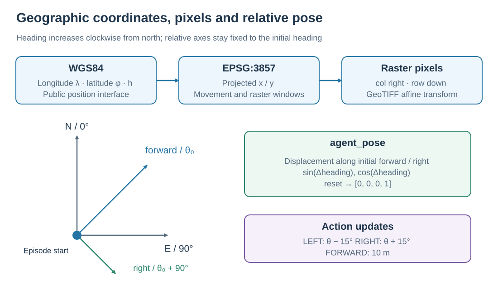
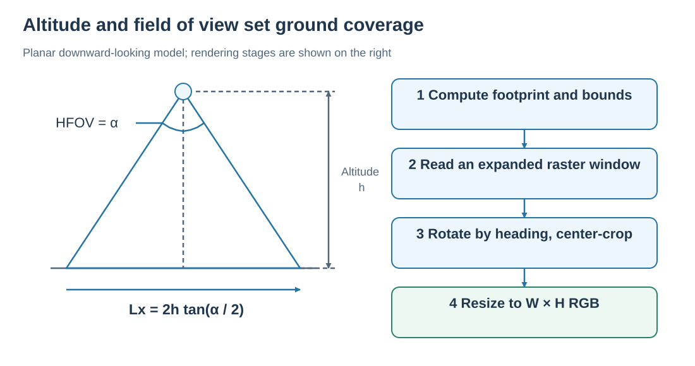
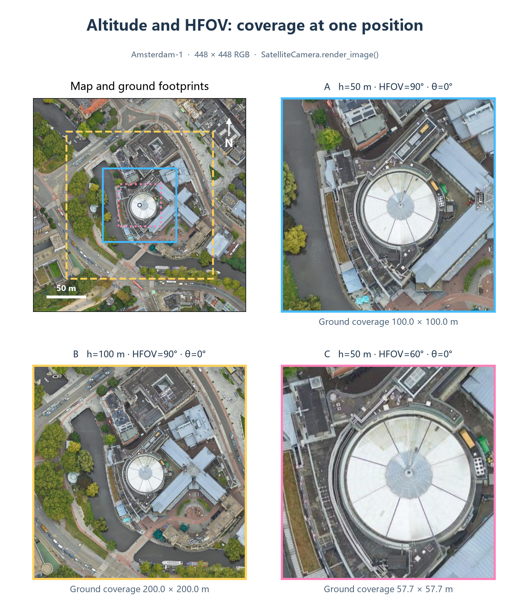
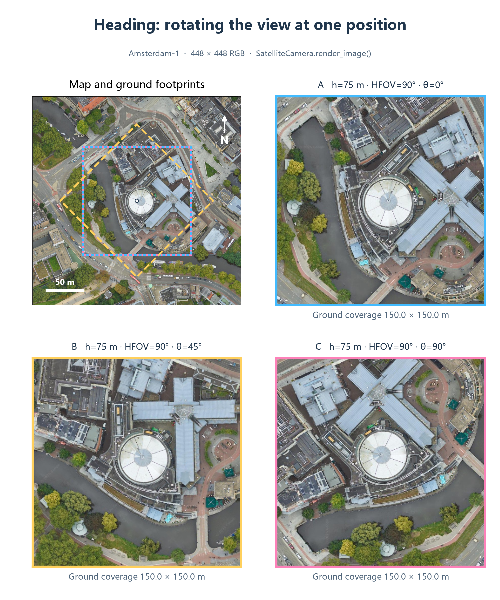

# SatSim: from satellite imagery to observations

SatSim represents a scene as a georeferenced satellite GeoTIFF. Given a pose and camera settings, it computes ground coverage, reads local imagery, rotates by heading, and resizes to the model's RGB input. The camera uses a downward-looking model over a ground plane; altitude controls observation scale.

## 1. Connecting geographic positions to pixels



<p class="figure-caption" align="center"><em>The relative forward/right axes are set by the initial heading and stay fixed throughout the episode. Action magnitudes in the figure use standard settings.</em></p>

| Representation | Units and directions | Role |
| --- | --- | --- |
| WGS84 `[longitude, latitude, altitude]` | Longitude/latitude in degrees, altitude in meters | Episodes and public agent state |
| EPSG:3857 `(x, y)` | Web Mercator projected meters; x east, y north | Internal position and raster windows |
| GeoTIFF `(row, col)` | Rows downward, columns rightward | Raster pixel access |
| Initial-heading `(forward, right)` | Ground meters relative to episode start | Displacement in `agent_pose` |

The GeoTIFF coordinate reference system and affine transform connect projected coordinates to pixels. SatSim opens scenes in EPSG:3857 and reuses open datasets for repeated access to a scene.

The local Web Mercator scale factor at latitude $\varphi$ is $k=1/\cos\varphi$. Rendering multiplies ground coverage by $k$ to obtain projected window dimensions; movement uses the same local conversion. Configured forward distances and camera coverage are therefore expressed in ground meters.

## 2. Altitude, field of view, and coverage



<p class="figure-caption" align="center"><em>Left: the horizontal field-of-view cross section. Right: the rendering sequence.</em></p>

For altitude $h$, horizontal field of view $\alpha$, and output dimensions $W,H$, the unrotated footprint over the ground plane has dimensions:

$$
L_x=2h\tan(\alpha/2),\qquad L_y=L_x\frac{H}{W}.
$$

With 448 × 448 output and 90° HFOV, altitude 50 m gives approximately 100 × 100 m coverage. At 100 m altitude, coverage grows to approximately 200 × 200 m, so the same building occupies fewer output pixels. Increasing HFOV at fixed altitude also expands coverage.

Output resolution sets how many pixels represent this region; the source GeoTIFF resolution determines the imagery detail available to sample.

## 3. Camera comparisons on a real scene

The figures below use one fixed center in `Amsterdam-1.tif`. All RGB observations come from the current `SatelliteCamera.render_image()` with 448 × 448 output. Colored outlines in the context map show footprints; the other panels show their rendered observations.



<p class="figure-caption" align="center"><em>A: h=50 m, HFOV=90°; B: h=100 m, HFOV=90°; C: h=50 m, HFOV=60°. Heading is 0° throughout. Coverage widths are approximately 100 m, 200 m, and 57.7 m.</em></p>



<p class="figure-caption" align="center"><em>At h=75 m and HFOV=90°, compare heading 0°, 45°, and 90°. Changing heading rotates the footprint and the rendered image content.</em></p>

## 4. Rendering RGB

`SatelliteCamera.render_image()` performs four stages:

1. Compute the footprint from altitude, HFOV, aspect ratio, and latitude scale; rotate its corners and obtain an axis-aligned bounding box.
2. Check the rotated extent against scene bounds and read an expanded window covering the rotation.
3. Rotate that window with OpenCV using heading, then center-crop to the requested coverage dimensions.
4. Resize to configured `WIDTH × HEIGHT`, returning `(H, W, 3)` `uint8` RGB.

A square footprint covers the same square at 0° and 90°, while the output orientation changes. At 45°, its axis-aligned bounding box is larger. Outlines in the figures show rotated quadrilaterals; raster reads use their bounding extent.

## 5. Updating position and heading

Heading $\theta$ increases clockwise from north: 0° is north and 90° is east. A forward action with ground distance $d$ uses the local scale $k$:

$$
x'=x+kd\sin\theta,\qquad y'=y+kd\cos\theta.
$$

Standard settings use $d=10$ m and turn angle $\beta=15°$. Left turns update to $\theta-\beta$, right turns to $\theta+\beta$, normalized to $[0°,360°)$. All four primitive actions preserve altitude.

Boundary handling has two stages. `is_navigable()` computes an inset map region using altitude and camera aspect ratio to accept or reject a candidate position. Rendering then checks the actual rotated window. A rejected forward move leaves the agent in place and still consumes a step. A rendering window outside the raster raises an error; the Viewer or evaluation record helps locate that state.

## 6. Interpreting relative pose

`agent_pose` returns:

```text
[delta_forward_m, delta_right_m, sin(delta_heading), cos(delta_heading)]
```

Displacement is measured from the start along the **initial-heading** forward/right axes. The implementation first estimates east/north displacements $\Delta E,\Delta N$ from longitude/latitude differences using a local spherical approximation at the midpoint latitude. It then rotates by initial heading $\theta_0$:

$$
\Delta f=\Delta N\cos\theta_0+\Delta E\sin\theta_0,\qquad
\Delta r=\Delta E\cos\theta_0-\Delta N\sin\theta_0.
$$

Starting east and moving 10 m east gives approximately forward=10 m, right=0 m. Turning right by 90° in place preserves those displacement components and changes the heading encoding to approximately `[1, 0]`. The sin/cos encoding keeps nearby headings close across angle wraparound.

Implementation: [`SatelliteCamera`](../../../satnav/sims/satsim/camera.py), [`SatSim`](../../../satnav/sims/satsim/satsim.py), [`GeoUtils`](../../../satnav/sims/satsim/geoutils.py), [`AgentPoseSensor`](../../../satnav/task/sensors.py), and [`lonlat_to_ego_displacement`](../../../satnav/core/utils.py). See the [Viewer](../applications/VIEWER.md) for visualization and [Core API](../core/CORE_API.md) for parameters.
