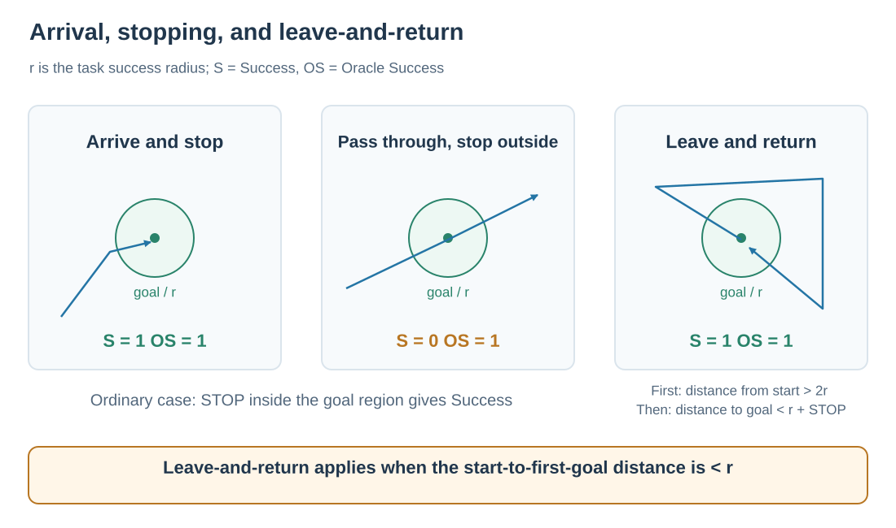
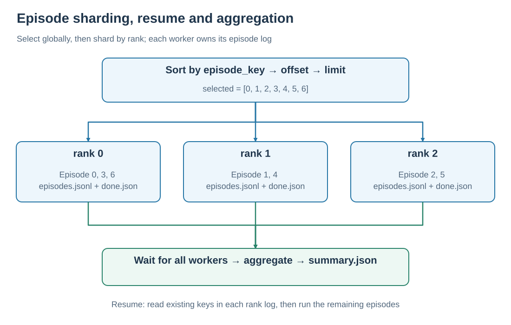

# Task definitions and evaluation principles

A SatNav Episode places an instruction, start, goal, and reference path in one scene. The policy chooses actions from the instruction and observations. The environment records the executed path and measures arrival and path efficiency.

## 1. Three task families

<em>Blue: object-boundary navigation. Green: navigation between landmarks. Yellow: navigation along roads or waterways. The right panel connects an instruction, reference route, and local observation.</em>

| Family | Stored `trajectory_type` | Main spatial relationship | Common subtypes |
| --- | --- | --- | --- |
| Boundary | `Boundary` | Follow a building or water-body outline while keeping it on a specified side | `loop`, `arc`, `extended` |
| Landmark | `LandmarkSet` | Use landmarks to identify direction and turns between locations | `one_turn`, `two_turn` |
| Route | `Road` | Follow roads, waterways, and their connections | `road`, `waterway`, `hybrid` |

Visual cues identify where to travel and turn; the instruction specifies the destination and stopping location. See [data format](../dataset/DATASET_FORMAT.md) for fields and a JSON example.

## 2. Three path representations

| Representation | Meaning | Use |
| --- | --- | --- |
| `waypoints` | Sparse, high-level route nodes | Key locations and turns |
| `reference_path` | A denser ordered sequence of geographic positions | Expert following, route visualization, and the reference length in SPL |
| Executed trajectory | Positions recorded after actual actions | Path length, final distance, and success |

One reference route may have multiple instructions. Results use `episode_key = <split>::<scene_id>::<episode_id>` to identify episodes; `trajectory_id` expresses route relationships.

Training trajectories follow `reference_path`; online trajectories result from model actions. See [expert trajectories](EXPERT_TRAJECTORIES.md) for waypoint selection and action generation.

## 3. Arrival, stopping, and success

Let $r$ be the task's success radius, $g$ its first goal, and $p_T$ the final position. In the ordinary case:

$$
\mathrm{Success}=\mathbf{1}[\mathrm{STOP\ called}\ \land\ d(p_T,g)<r].
$$

Oracle Success records whether the episode ever entered $d(p_t,g)<r$, and stays at 1 once achieved. Reading both measures distinguishes arrival at the goal region from stopping there.

<em>Arrows show executed paths. In the right panel, start and goal coincide; the agent departs, returns, and stops.</em>

For episodes with nearby starts and goals, the current implementation enables **leave-and-return** when $d(p_0,g)<r$. Boundary loops commonly meet this condition; the trigger is the start-to-goal distance. The sequence is:

1. At some step, distance from the start becomes strictly greater than $2r$, setting the departure flag.
2. Subsequently, distance to the goal becomes strictly less than $r$, giving Oracle Success=1.
3. Executing STOP inside the goal region gives Success=1.

For a loop with $r=10$ m, the agent must first move more than 20 m from the start, then return within 10 m of the goal and stop. Boundary arcs or extended routes whose start-to-goal distance is at least $r$ use ordinary success evaluation.

Success uses the final position, STOP, and departure state above; reference route length enters the SPL calculation.

## 4. Measuring path efficiency

Let $L$ be the sum of distances between consecutive executed positions, and $L_{\mathrm{ref}}$ the corresponding sum along the reference path:

$$
\mathrm{SPL}=\mathrm{Success}\,
\frac{L_{\mathrm{ref}}}{\max(L_{\mathrm{ref}},L)}.
$$

SatNav accumulates geographic distances. In-place turns, STOP, and rejected forward moves consume steps while adding zero positional path length.

| Example with a 100 m reference path | Success | Executed length | SPL |
| --- | ---: | ---: | ---: |
| Stop inside the goal region after 100 m | 1 | 100 m | 1.00 |
| Stop inside the goal region after 125 m | 1 | 125 m | 0.80 |
| Stop outside the goal region after 125 m | 0 | 125 m | 0.00 |

With fewer than two reference points, the implementation uses start-to-goal distance as the reference length. A nonpositive reference length gives SPL=0. `distance_to_goal` tracks distance to the first goal; `path_length` tracks cumulative executed length.

## 5. Generation and evaluation thresholds

| Task | Expert waypoint arrival radius | Online success radius |
| --- | ---: | ---: |
| Boundary | 10 m | 10 m |
| LandmarkSet | 3 m | 30 m |
| Road | 10 m | 10 m |

The generation radius controls waypoint switching with `d ≤ radius`. The evaluation radius controls task scoring with `d < radius`. The smaller LandmarkSet generation radius brings training trajectories closer to intermediate landmark positions.

Configurations: [`trajectory_generation.yaml`](../../../applications/episode_processing/configs/trajectory_generation.yaml) and [`satnav_eval_task.yaml`](../../../configs/satnav_eval_task.yaml).

## 6. Aggregating episodes

<em>Seven selected episodes are split across three ranks. Each rank resumes from its own log.</em>

The Evaluator sorts by stable key, applies offset and limit, and assigns `selected[rank::world_size]`. Completed records contain per-episode metrics; exceptions produce `status=error`. The aggregator takes the arithmetic mean of finite values for each metric across `status=ok` records and reports completion and error counts separately. Duplicate keys retain the last record.

Formal evaluation uses the complete split and standard 500-step limit. See [evaluation](../evaluation/README.md) for commands, resume, and result fields. Implementation: [`measures.py`](../../../satnav/task/measures.py) and [`evaluation`](../../../satnav/evaluation/).
