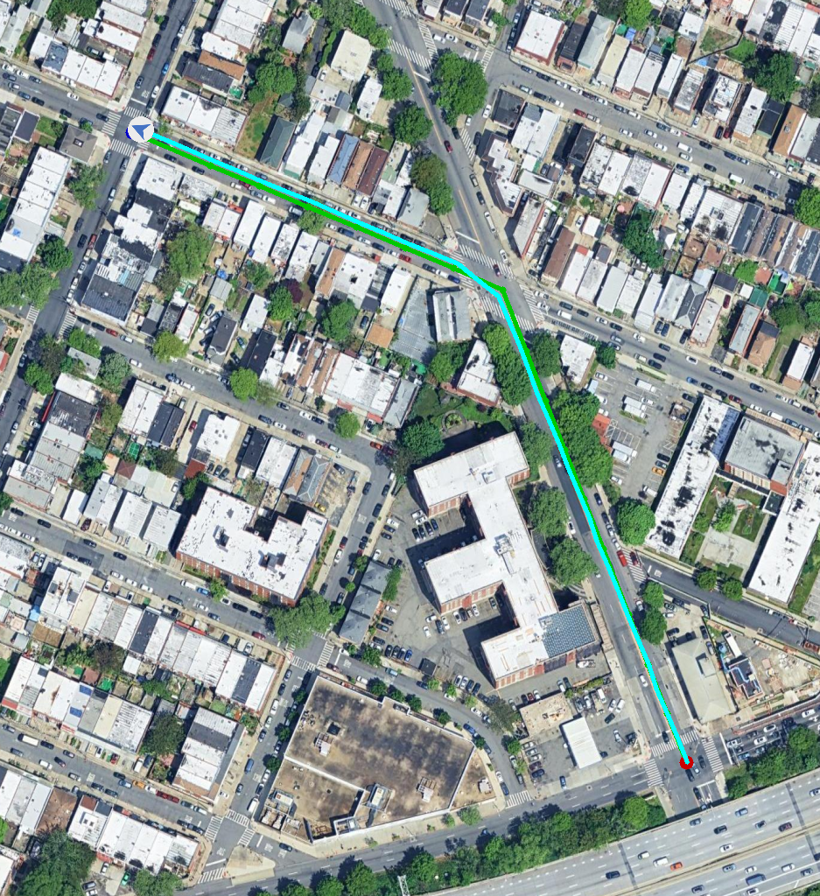

# SatNav Examples

SatNav includes two runnable navigation examples covering environment setup,
episode execution, metrics, and visualization.

| Example | Purpose | Default output |
| --- | --- | --- |
| `reference_follower_example.py` | Run one episode with `ReferencePathFollower` along the recorded reference path | Final observation, top-down map, and terminal metrics |
| `satnav_path_follower_example.py` | Run every episode with greedy waypoint navigation | Per-episode metrics JSON and optional MP4 videos |

> Both examples use the bundled synthetic episodes and CC0 scene. SatNav-v0.1
> and satellite scenes are not required.

## 1. Prepare the environment

Complete [Installation](INSTALLATION.md), then run from the repository root:

```bash
python -m pip install -e .
```

Install application dependencies to generate MP4 videos:

```bash
python -m pip install -e '.[applications]'
```

The default example resources are:

```text
applications/resources/
├── map.tif
├── satnav_example_episodes.json
└── satnav_example_task.yaml
```

## 2. Reference Path Follower

This example loads one episode and follows its recorded reference path. Use it
to learn the environment interaction flow and verify path execution.

```bash
python examples/reference_follower_example.py
```

The command prints episode information, action statistics, Success, SPL,
Distance to Goal, and Path Length. Images are written to:

```text
output/examples/reference_follower/
├── final_observation_example.png
└── topdown_map_example.png
```



<p class="figure-caption" align="center"><em>Top-down map produced by Reference Path Follower.</em></p>

Choose another output directory with:

```bash
python examples/reference_follower_example.py \
  --output-dir output/my_reference_example
```

## 3. SatNav Path Follower

This example visits every episode in the configuration. `SatNavPathFollower`
targets each reference-path waypoint and greedily chooses forward or turn
actions from the current pose.

Disable video for a fast first validation:

```bash
python examples/satnav_path_follower_example.py --no-video
```

Results are written to:

```text
output/examples/satnav_path_follower/
└── satnav_example_episodes_<timestamp>.json
```

The JSON includes aggregate success rate, mean SPL, mean steps, and per-episode
path length, final distance, and action distribution.

Generate navigation videos with:

```bash
python examples/satnav_path_follower_example.py
```

```text
output/examples/satnav_path_follower/
├── episode_<episode_id>_video.mp4
└── satnav_example_episodes_<timestamp>.json
```

> Video output requires `imageio-ffmpeg` and a task configuration with the
> `TOP_DOWN_MAP` measurement enabled.

<video controls width="100%">
  <source src="../../assets/examples/episode_1602_video.mp4" type="video/mp4">
</video>

*SatNavPathFollower on NewYork-3, episode 1602. RGB is shown on the left, the
top-down map on the right, and the instruction below.*

If the current renderer cannot play embedded video, [open the MP4
directly](../../assets/examples/episode_1602_video.mp4).

## 4. Use a custom configuration

Both examples accept `--config`:

```bash
python examples/reference_follower_example.py \
  --config path/to/task.yaml \
  --output-dir output/reference_follower

python examples/satnav_path_follower_example.py \
  --config path/to/task.yaml \
  --output-dir output/satnav_path_follower \
  --no-video
```

At minimum, configure:

- `DATASET.DATA_PATH`: episode JSON;
- `DATASET.SCENES_DIR`: GeoTIFF directory;
- `TASK.POSSIBLE_ACTIONS`: available actions;
- `TASK.SUCCESS_DISTANCE`: success radii by trajectory type;
- `SIMULATOR.FORWARD_STEP_SIZE` and `SIMULATOR.TURN_ANGLE`: movement steps.

Verify the bundled example before replacing it with custom episodes and
scenes.

## 5. How the examples differ

`ReferencePathFollower` receives the full reference path and follows it in one
episode. `SatNavPathFollower` receives one waypoint at a time, computes actions
from simulator state, and supports multiple episodes, structured metrics, and
video output. Both determine navigation actions from predefined rules and simulator state.
