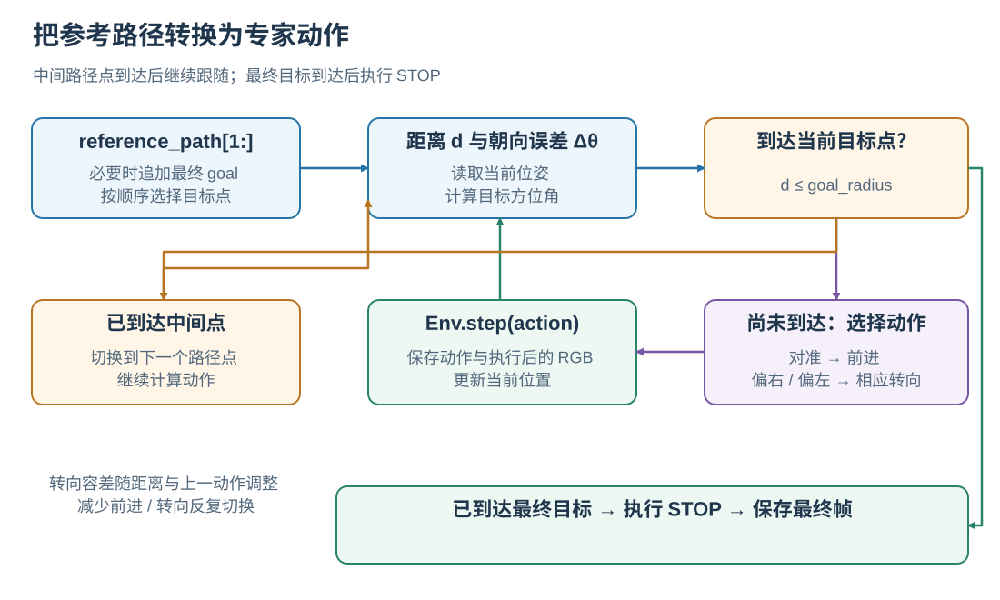
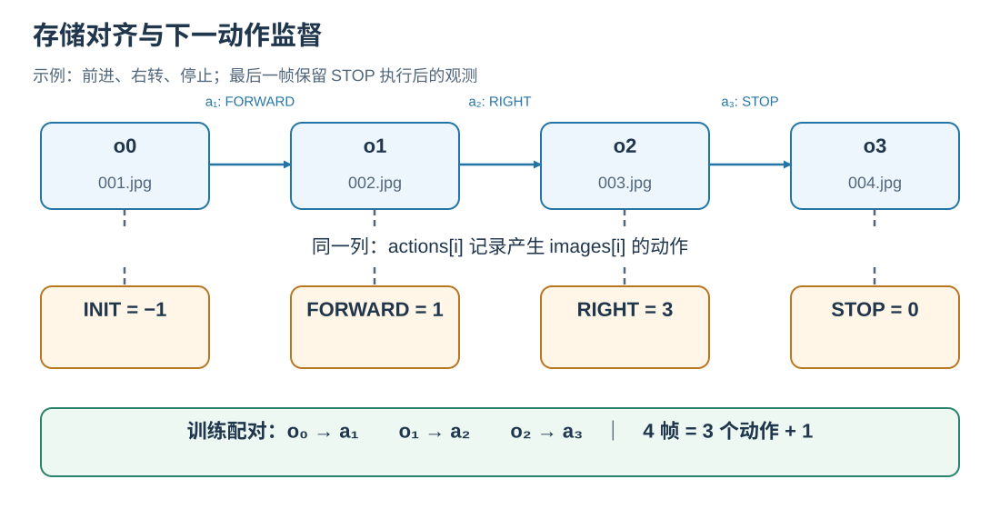

# 从参考路径到专家训练轨迹

专家轨迹把 Episode 的地理参考路线转换为模型训练使用的“图像、指令、动作”。生成器加载 GeoTIFF 和 Episode，跟随参考路径，在每次环境交互后保存 RGB 和动作，最终输出 `annotations.json` 与帧目录。运行命令见[轨迹生成指南](../applications/TRAJECTORY_GENERATION.md)。

## 1. 从参考路径选择导航目标

生成器取 `reference_path[1:]` 作为依次跟随的目标点，起点由环境 reset 设置。如果路径为空，或最后一点与 Episode 的第一个 goal 不一致，就追加该 goal。当前位置、高度和 heading 由 SatSim 维护。



<p class="figure-caption" align="center"><em>到达中间目标点后切换目标；到达最终目标后向环境执行 STOP。最大步数由环境配置控制。</em></p>

串行和并行生产入口均使用 `SatNavPathFollower` 对当前目标计算下一动作。`ReferencePathFollower` 将多路径点跟随封装为独立辅助接口，可通过[运行示例](../getting-started/EXAMPLES.md)观察效果。

## 2. 跟随器怎样决定前进和转向

设当前 heading 为 $\theta$，当前位置指向目标的地理方位角为 $b$。归一化后的朝向误差为：

$$
\Delta\theta=\mathrm{wrap}_{[-180°,180°)}(b-\theta).
$$

跟随器先计算距目标的地理距离 $d$：

| 条件 | 返回动作 |
| --- | --- |
| $d\le r$，已进入当前目标的到达半径 | `STOP`，交给生成器处理目标切换 |
| $d>r$ 且 $|\Delta\theta|\le\tau$ | `MOVE_FORWARD` |
| 超出转向容差且 $\Delta\theta>0$ | `TURN_RIGHT` |
| 超出转向容差且 $\Delta\theta<0$ | `TURN_LEFT` |

标准转向步长为 $\beta=15°$。正常情况下容差 $\tau=\beta/2=7.5°$；距目标小于 $2r$ 时扩大为 $\beta$。若上一动作是前进，容差再乘 1.5，并限制为最多 $1.5\beta$。这让接近目标时或连续前进时的微小朝向变化更平滑地转化为动作。

到达中间路径点时，生成器推进路径点索引，继续选择动作；这个内部 `STOP` 用来表示“当前点已到达”。到达最终目标时，生成器实际调用 `Env.step(STOP)`，结束 Episode 并保存最终观测。

## 3. 图像与动作怎样对齐



<p class="figure-caption" align="center"><em>橙色行对应写入文件的动作数组，蓝色行为图像；下一动作监督使用左侧观测预测其后的动作。</em></p>

设 $o_0$ 为 reset 后的初始观测，$a_1$ 为第一个动作，执行后得到 $o_1$。存储序列为：

```text
images:   [o0,   o1, o2, ..., oT]
actions:  [INIT, a1, a2, ..., aT]
```

其中 `INIT=-1`，`aT=STOP`。相同索引下的 `actions[i]` 记录产生 `images[i]` 的动作。因此，预测下一动作的训练样本应将 $o_{i-1}$ 与 $a_i$ 配对；预测动作块时，从当前观测对应位置之后取连续的专家动作。

以 `actions=[-1,1,3,0]` 为例，四张图分别是初始观测、前进后观测、右转后观测、STOP 后观测，`steps=3`。最后两帧可以具有相同的 RGB，因为 STOP 保持位姿。

$$
N_{\mathrm{JPEG}}=\mathrm{len(actions)}=\mathrm{steps}+1.
$$

动作编码、annotation 字段和目录结构见[数据格式](../dataset/DATASET_FORMAT.md)。

## 4. 为什么要保存离线轨迹

渲染和专家跟随在数据生产时完成。训练器直接读取 JPEG 与动作序列，可以重复采样同一轨迹、构建不同历史窗口，并使用统一的专家行为训练不同模型。

Classic 模型逐步学习动作分类，VLM 将相应的动作或动作块转换成文本监督。图像预处理、历史采样和文本模板由对应模型实现。在线评测时，后续观测来自模型实际动作形成的新轨迹，形成[系统闭环](OVERVIEW.md)。

## 5. 批量生产与恢复

并行生成器按场景组织任务，使 worker 尽量重复使用已打开的 GeoTIFF。每个 worker 持有自己的环境和跟随器，Episode 完成后保存图像、annotation 与完成标记。

恢复时，生成器检查 Episode 内容、生成配置、场景标识及已有帧的完整性。匹配的产物被复用，需要重新生成的 Episode 从其起点执行。最终汇集为训练使用的公开 `annotations.json`。

生产配置使用 448 × 448 RGB、90° HFOV、10 m 前进步长、15° 转向和最多 500 步。waypoint 半径与评测半径的关系见[任务与评测原理](TASKS_AND_METRICS.md)。

实现入口：[`SatNavPathFollower`](../../../satnav/navigation/path_follower.py)、[`串行生成`](../../../applications/trajectory_generation/runner.py)、[`并行生成`](../../../applications/trajectory_generation/generate_parallel.py)、[`产物完整性与缓存检查`](../../../applications/trajectory_generation/utils.py)。
