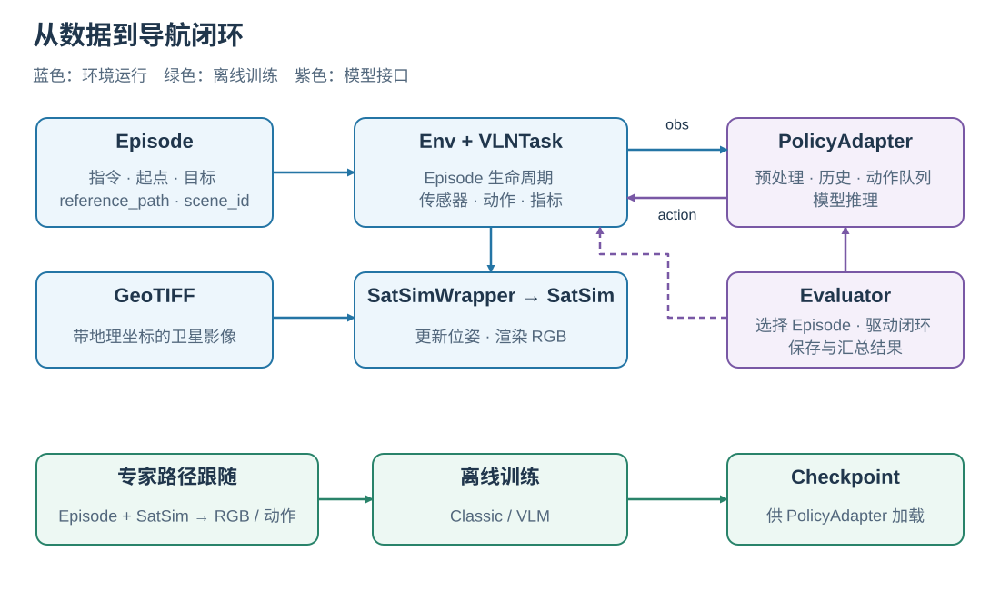
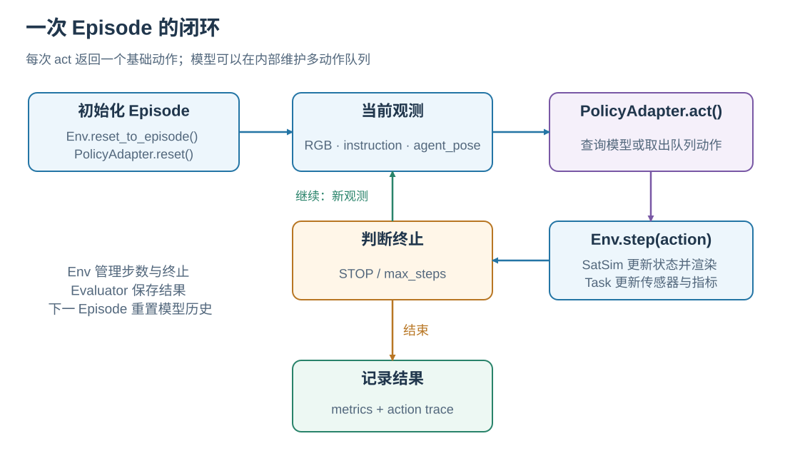

# SatNav 系统全景与运行闭环

SatNav 将一条语言导航任务连接到卫星场景、导航策略和评测指标。任务由 Episode 描述，SatSim 根据智能体位姿生成 RGB 观测，策略读取观测并返回动作；环境执行动作后产生新观测，直到策略停止或达到步数上限。

建议依次阅读本页、[SatSim 观测原理](SATSIM.md)、[任务与评测原理](TASKS_AND_METRICS.md)和[专家轨迹原理](EXPERT_TRAJECTORIES.md)。运行第一个示例见[运行示例](../getting-started/EXAMPLES.md)。

## 1. 系统由哪些部分组成

<em>环境与策略形成在线闭环；专家路径跟随使用同一环境生成离线训练数据。</em>

| 组件 | 接收什么 | 负责什么 |
| --- | --- | --- |
| `SatNavDataset` / `VLNEpisode` | Episode JSON、场景目录 | 加载任务、解析场景，提供指令、起点、目标和参考路径 |
| `Env` | Task 配置、Episode、动作 | 管理 Episode 生命周期、步数、终止状态和公共交互接口 |
| `VLNTask` | Episode、Simulator | 组织传感器、动作和指标计算 |
| `SatSimWrapper` / `SatSim` | GeoTIFF、位姿、相机参数 | 将动作转换为地理状态更新，并渲染 RGB |
| `PolicyAdapter` | 当前观测、Episode 上下文 | 管理模型输入、历史状态和动作队列，返回一个基础动作 |
| `Evaluator` | Env、PolicyAdapter、评测配置 | 选择和分配 Episode、驱动交互、保存并汇总结果 |

Episode 中的 `scene_id` 是场景逻辑名称，例如 `Amsterdam-1`。Dataset 根据 `SCENES_DIR` 找到对应 GeoTIFF；其像素和地理坐标映射共同支撑观测生成。Episode JSON、场景影像和离线轨迹这三类数据的字段见[数据格式](../dataset/DATASET_FORMAT.md)。

## 2. 一次导航怎样运行

<em>每条回路边表示一次观测或动作传递；一个模型查询可以通过动作队列服务多个环境 step。</em>

1. `Env.reset_to_episode()` 加载场景，把智能体放在 Episode 起点并设置初始朝向，然后重置传感器与指标。
2. `PolicyAdapter.reset()` 清空上一个 Episode 的历史图像、循环状态和待执行动作。
3. `PolicyAdapter.act(observation)` 读取当前 RGB、指令以及模型需要的相对位姿，返回 `PolicyStep`。
4. `Env.step(action)` 执行一个基础动作，更新传感器与指标，返回新的 `observation, done, info`。
5. 若尚未结束，使用新观测继续决策；若结束，Evaluator 保存该 Episode 的记录。

例如，模型一次生成“前进、前进、右转”，adapter 可以将三步放入队列。接下来三次 `act()` 分别返回一个动作，环境也执行三次 `step()`，每一步都有自己的观测、步数和指标。队列耗尽后，adapter 再调用模型生成下一组动作。

`Env` 在执行 `STOP` 或达到 `MAX_EPISODE_STEPS` 时结束 Episode。Evaluator 还按自己的 `max_steps` 限制运行长度。进入目标成功半径后，策略继续决定何时停止；成功条件见[任务与评测原理](TASKS_AND_METRICS.md)。

## 3. 连续状态与离散动作如何共存

智能体的位置由经度、纬度和高度表示，heading 是角度。基础动作包括 `STOP`、`MOVE_FORWARD`、`TURN_LEFT`、`TURN_RIGHT`。标准配置一次前进 10 m，转向 15°；前进方向由当前 heading 决定，因此轨迹由连续地理位置构成。

相机把当前位置附近的卫星影像转换成局部 RGB 观测。高度与 HFOV 控制可见范围，heading 控制旋转。智能体移动后，下一帧来自新的地图区域。具体几何关系见[SatSim 观测原理](SATSIM.md)。

## 4. 离线训练与在线评测如何连接

训练数据生产沿 Episode 的 `reference_path` 驱动 SatSim，保存 RGB 和专家动作。Classic 或 VLM 训练器随后读取这些文件，以指令和视觉观测预测专家动作。完成训练后，checkpoint 由相应的 PolicyAdapter 加载，在在线闭环中产生导航动作。

| 阶段 | 动作来源 | 观测来源 | 主要产物 |
| --- | --- | --- | --- |
| 专家轨迹生成 | 路径跟随器 | SatSim 实时渲染 | RGB JPEG、`annotations.json` |
| 离线训练 | 专家动作提供监督 | 已保存的 RGB JPEG | 模型 checkpoint |
| 在线评测 | 导航策略预测 | SatSim 按实际执行轨迹渲染 | 逐 Episode 记录与汇总指标 |

两条路径共享环境和动作语义。模型自己的图像采样、文本格式、历史记忆和优化器由各 baseline 实现。数据生产过程见[专家轨迹原理](EXPERT_TRAJECTORIES.md)，启动训练见[训练指南](../training/README.md)。

## 5. 从原理到接口

| 想继续了解 | 阅读入口 |
| --- | --- |
| reset / step、观测和动作参数 | [Core API](../core/CORE_API.md) |
| 把自己的模型接入闭环 | [模型接入](../development/MODEL_INTEGRATION.md) |
| 选择 Episode、多进程运行与恢复 | [统一评测](../evaluation/README.md) |
| 查看模型和环境的实际交互 | [Viewer](../applications/VIEWER.md) |

实现入口：[`Env`](../../../satnav/core/env.py)、[`VLNTask`](../../../satnav/task/vln_task.py)、[`SatSimWrapper`](../../../satnav/sims/satsim_wrapper.py)、[`Evaluator`](../../../satnav/evaluation/evaluator.py)。
