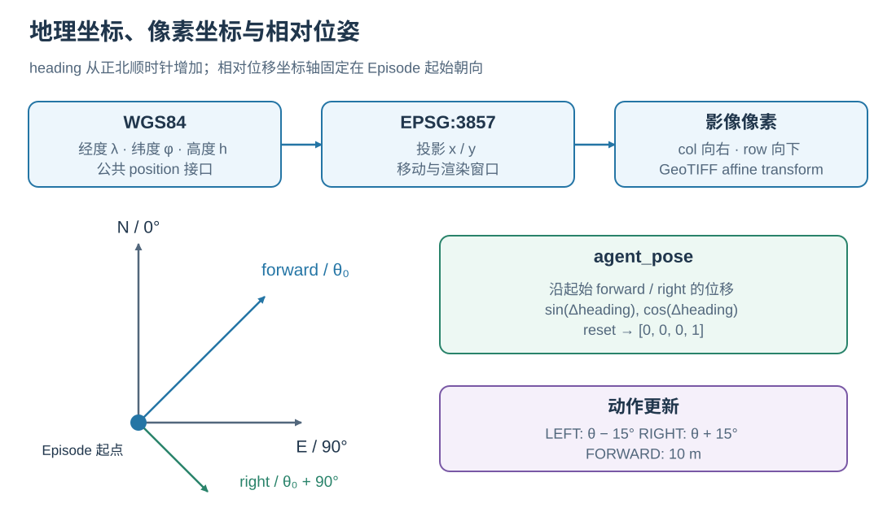
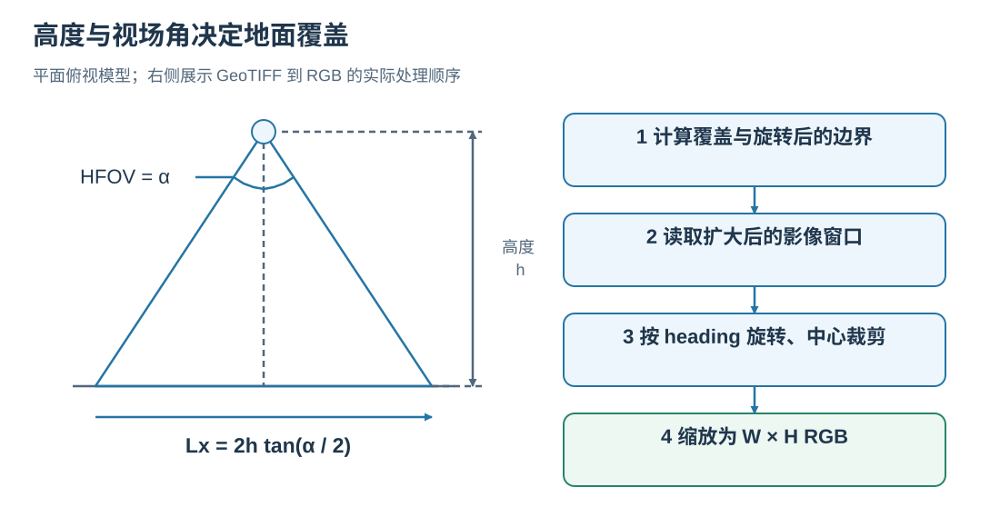
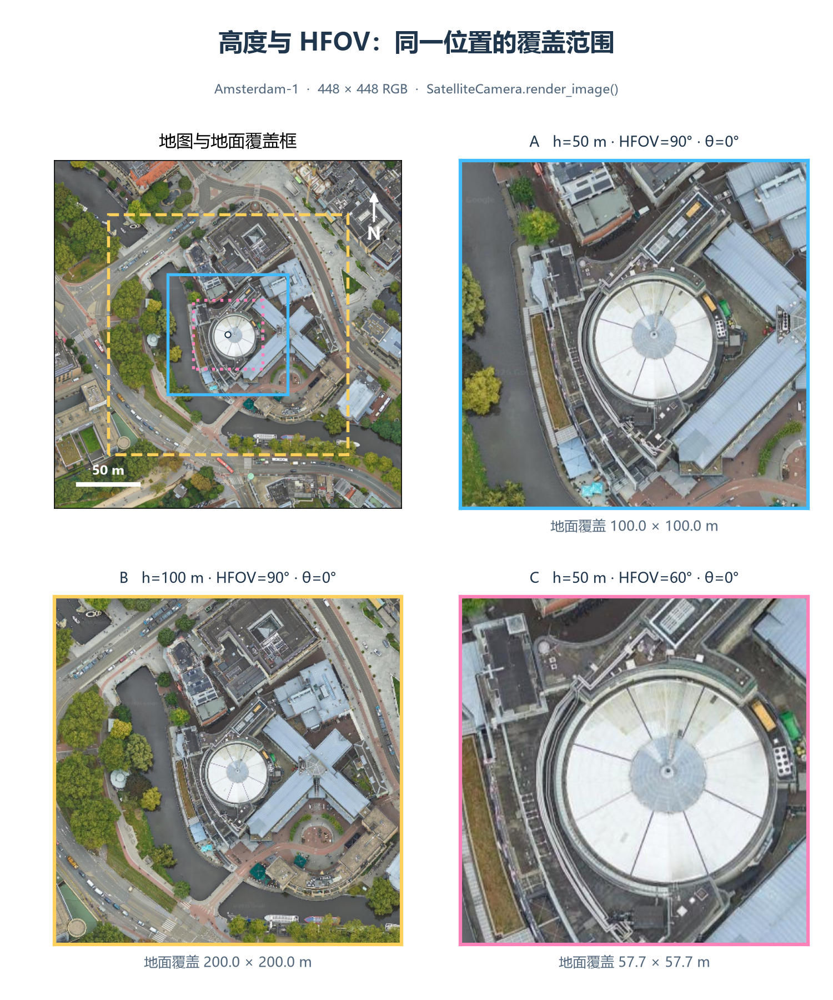
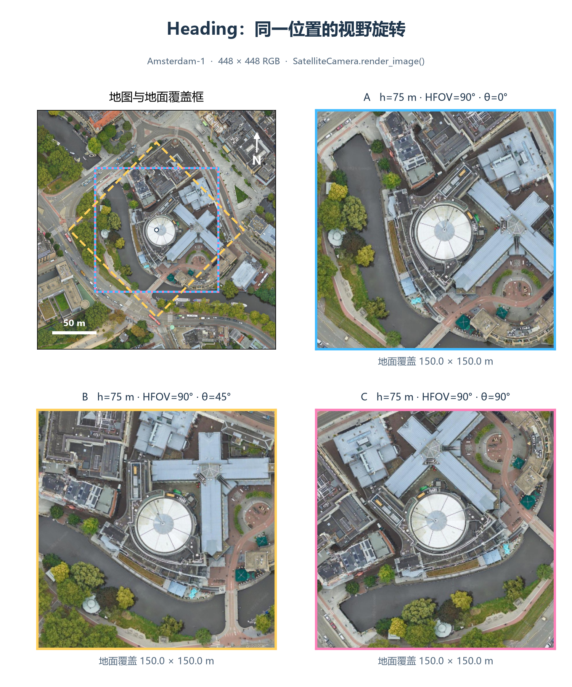

# SatSim：从卫星影像到导航观测

SatSim 使用带地理坐标的卫星 GeoTIFF 表示场景。给定位姿和相机参数后，它确定地面覆盖范围，读取局部影像，按 heading 旋转并缩放，得到模型看到的 RGB。当前相机采用平面地面上的垂直俯视模型，高度控制观测尺度。

## 1. 地理位置如何对应图像像素



<p class="figure-caption" align="center"><em>相对位姿的 forward / right 坐标轴由初始 heading 确定，并在整个 Episode 中保持固定。图中的动作幅度采用标准配置。</em></p>

| 表示 | 单位与方向 | 用途 |
| --- | --- | --- |
| WGS84 `[longitude, latitude, altitude]` | 经度、纬度为度，高度为米 | Episode 和公开 agent state |
| EPSG:3857 `(x, y)` | Web Mercator 投影米；x 向东、y 向北 | 模拟器内部位置与影像窗口 |
| GeoTIFF `(row, col)` | 行向下、列向右 | 定位和读取栅格像素 |
| 初始朝向下的 `(forward, right)` | 地面米；相对 Episode 起点 | `agent_pose` 的位移部分 |

GeoTIFF 的坐标参考系和仿射变换连接投影坐标与栅格像素。SatSim 打开场景时将其统一到 EPSG:3857，重复使用同一场景时复用已打开的数据集。

Web Mercator 在纬度 $\varphi$ 处的局部尺度因子为 $k=1/\cos\varphi$。渲染器把地面覆盖长度乘以 $k$，得到投影平面上的窗口尺寸；移动也使用相同的局部尺度换算。因此，配置中的前进距离和相机覆盖宽度均按地面米解释。

## 2. 高度、视场角与地面覆盖



<p class="figure-caption" align="center"><em>左侧为水平视场角所在截面；右侧为渲染器处理顺序。</em></p>

设相机高度为 $h$，水平视场角为 $\alpha$，输出图像宽高为 $W,H$。在平面俯视模型中，未旋转的地面覆盖宽高为：

$$
L_x=2h\tan(\alpha/2),\qquad L_y=L_x\frac{H}{W}.
$$

当输出为 448 × 448、HFOV 为 90° 时，50 m 高度对应约 100 × 100 m 的地面范围。高度增至 100 m，覆盖扩大到约 200 × 200 m；同样的建筑在固定像素尺寸的输出中随之变小。保持高度不变而增大 HFOV，也会扩大覆盖范围。

输出分辨率决定这片范围用多少像素表示，场景 GeoTIFF 的源分辨率决定可读取的影像细节。

## 3. 真实场景中的相机对比

下面的图使用 `Amsterdam-1.tif` 中同一个中心位置。所有 RGB 均由当前 `SatelliteCamera.render_image()` 生成，保持 448 × 448 输出。左上角地图中的彩框是地面 footprint，其余三个面板展示相应观测。



<p class="figure-caption" align="center"><em>A：h=50 m、HFOV=90°；B：h=100 m、HFOV=90°；C：h=50 m、HFOV=60°。三种设置的 heading 均为 0°，覆盖宽度分别约 100 m、200 m、57.7 m。</em></p>



<p class="figure-caption" align="center"><em>固定 h=75 m、HFOV=90°，比较 heading 为 0°、45°、90° 的 footprint 与 RGB。朝向改变时，地面可见区域随视野框旋转，图像内容也随渲染变换旋转。</em></p>

## 4. RGB 怎样生成

`SatelliteCamera.render_image()` 按以下顺序执行：

1. 由高度、HFOV、宽高比和纬度尺度计算 footprint，再旋转四个角点，得到其轴对齐包围框。
2. 检查旋转后的范围是否位于影像内，并读取能覆盖旋转过程的扩大窗口。
3. 使用 OpenCV 按 heading 旋转窗口；从旋转结果中心裁出目标覆盖尺寸。
4. 缩放到配置的 `WIDTH × HEIGHT`，返回 `(H, W, 3)`、`uint8` RGB。

方形视野在 0° 和 90° 时覆盖同一个正方形，但输出图像方向不同；45° 时，footprint 的轴对齐包围框更大。图中的 footprint 表示实际旋转后的四边形，读取窗口使用其包围范围。

## 5. 动作如何更新位置和朝向

heading $\theta$ 从正北 0° 顺时针增加，90° 为正东。一次地面距离为 $d$ 的前进，在当前位置纬度对应的尺度 $k$ 下更新：

$$
x'=x+kd\sin\theta,\qquad y'=y+kd\cos\theta.
$$

标准配置使用 $d=10$ m、转向角 $\beta=15°$。左转更新为 $\theta-\beta$，右转更新为 $\theta+\beta$，角度归一化到 $[0°,360°)$。四个基础动作保持高度不变。

边界处理包含两步：`is_navigable()` 按相机高度和宽高比计算地图内缩区域，决定是否接受新位置；渲染器再检查旋转后窗口的实际边界。前进候选位置未通过前一步时保持原位，该动作仍消耗一个 step。渲染窗口越界时会返回错误，Viewer 或评测记录可用于定位对应状态。

## 6. 相对位姿表达什么

`agent_pose` 返回：

```text
[delta_forward_m, delta_right_m, sin(delta_heading), cos(delta_heading)]
```

位移以起点为原点，沿**初始朝向**的 forward / right 轴分解。当前代码先用经纬度差和中间纬度的球面局部近似计算向东、向北位移 $\Delta E,\Delta N$，再按初始 heading $\theta_0$ 旋转：

$$
\Delta f=\Delta N\cos\theta_0+\Delta E\sin\theta_0,\qquad
\Delta r=\Delta E\cos\theta_0-\Delta N\sin\theta_0.
$$

例如起始朝向正东，向东移动 10 m 后，forward 约为 10 m、right 约为 0 m。随后原地右转 90°，位移分量保持不变，朝向编码变为约 `[1, 0]`。使用 sin/cos 让相近朝向在跨越角度边界时仍具有相近表示。

实现入口：[`SatelliteCamera`](../../../satnav/sims/satsim/camera.py)、[`SatSim`](../../../satnav/sims/satsim/satsim.py)、[`GeoUtils`](../../../satnav/sims/satsim/geoutils.py)、[`AgentPoseSensor`](../../../satnav/task/sensors.py)、[`lonlat_to_ego_displacement`](../../../satnav/core/utils.py)。运行和可视化见[Viewer](../applications/VIEWER.md)，接口参数见[Core API](../core/CORE_API.md)。
