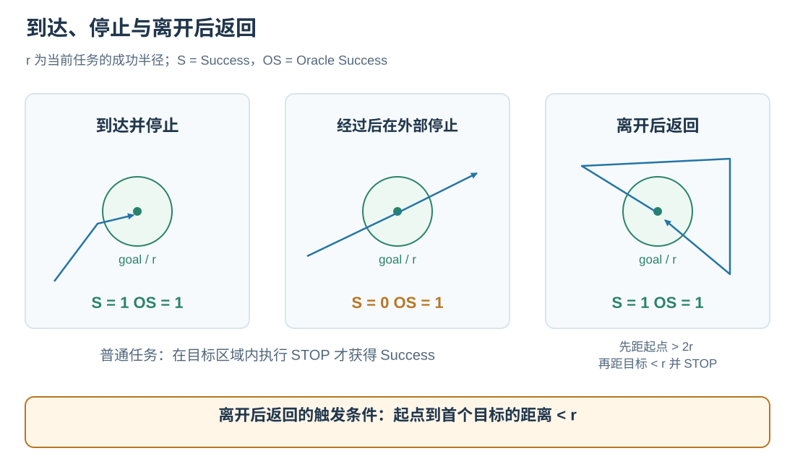

# 任务定义与评测原理

一个 SatNav Episode 将语言指令、起点、目标与参考路径放在同一场景中。策略根据指令和逐步观测选择动作，环境记录实际轨迹并计算到达与路径效率指标。

## 1. 三类任务要求智能体做什么

<em>蓝色为沿物体边界导航，绿色为地标之间的导航，黄色为沿道路或水路导航。右侧展示一条指令、参考路线与局部观测的对应关系。</em>

| 任务族 | 数据中的 `trajectory_type` | 主要空间关系 | 常见子类 |
| --- | --- | --- | --- |
| Boundary | `Boundary` | 沿建筑、水体等目标的轮廓运动，保持目标在指定一侧 | `loop`、`arc`、`extended` |
| Landmark | `LandmarkSet` | 借助地标确定方向和转折，在地标间前进 | `one_turn`、`two_turn` |
| Route | `Road` | 沿道路、水道及其连接关系前进 | `road`、`waterway`、`hybrid` |

任务中的视觉线索决定“沿哪里走”和“在哪里转弯”；指令规定目标与停止位置。数据字段和完整 JSON 示例见[数据格式](../dataset/DATASET_FORMAT.md)。

## 2. 三种路径表示怎样连接

| 表示 | 含义 | 用途 |
| --- | --- | --- |
| `waypoints` | 任务的稀疏高层路径节点 | 描述关键位置与转折 |
| `reference_path` | 更密集的有序地理位置序列 | 专家跟随、参考路线展示、SPL 的参考长度 |
| 实际执行轨迹 | 每次动作后记录的位置 | 路径长度、最终距离和成功判定 |

同一参考路线可配有多条语言指令。Episode 用 `episode_key = <split>::<scene_id>::<episode_id>` 关联运行结果，`trajectory_id` 用于表达路线关系。

训练轨迹由跟随器逐步追踪 `reference_path` 生成；在线评测的实际轨迹由模型动作产生。逐点选择与动作生成过程见[专家轨迹原理](EXPERT_TRAJECTORIES.md)。

## 3. 到达与停止怎样决定成功

设当前任务的成功半径为 $r$，第一个 goal 为 $g$，最终位置为 $p_T$。普通情况下：

$$
\mathrm{Success}=\mathbf{1}[\mathrm{STOP\ called}\ \land\ d(p_T,g)<r].
$$

Oracle Success 记录 Episode 过程中是否曾进入 $d(p_t,g)<r$ 的区域；一旦满足，后续保持为 1。两者一起阅读，可以区分“到过目标区域”与“在目标区域停止”。

<em>箭头表示实际轨迹。右图中起点与目标重合；满足离开条件后，返回目标区域并停止。</em>

对于起点与目标接近的 Episode，当前实现通过 $d(p_0,g)<r$ 启用 **leave-and-return** 规则。这常用于 Boundary 环路；触发判断使用起点与目标距离。规则按顺序要求：

1. 某一步距起点严格大于 $2r$，记为已经离开。
2. 随后距目标严格小于 $r$，Oracle Success 变为 1。
3. 在目标成功半径内执行 STOP，Success 变为 1。

例如 $r=10$ m 的闭环任务，需要先离开起点超过 20 m，再返回目标 10 m 范围内停止。Boundary 的弧形或延伸路线若起终点距离达到 $r$，使用普通成功判定。

Success 的计算使用最终位置、STOP 和上述离开状态；任务路线的参考长度则进入 SPL 计算。

## 4. 路径效率如何计分

设 $L$ 为实际轨迹相邻位置距离之和，$L_{\mathrm{ref}}$ 为 reference path 相邻位置距离之和，则：

$$
\mathrm{SPL}=\mathrm{Success}\,
\frac{L_{\mathrm{ref}}}{\max(L_{\mathrm{ref}},L)}.
$$

SatNav 用地理距离累计路径长度。原地转向、STOP 或未移动的前进动作增加步数，其位置变化对应的路径长度为零。

| 示例，参考长度均为 100 m | Success | 实际长度 | SPL |
| --- | ---: | ---: | ---: |
| 在目标范围内停止，实际走了 100 m | 1 | 100 m | 1.00 |
| 在目标范围内停止，实际走了 125 m | 1 | 125 m | 0.80 |
| 走了 125 m，最终在目标范围外停止 | 0 | 125 m | 0.00 |

没有至少两个参考路径点时，实现使用起点到目标的距离作为参考长度；参考长度小于等于零时 SPL 为零。`distance_to_goal` 记录当前位置到首个目标的距离，`path_length` 记录累计实际长度。

## 5. 生成阈值与评测阈值

| 任务 | 专家生成的 waypoint 到达半径 | 在线评测的成功半径 |
| --- | ---: | ---: |
| Boundary | 10 m | 10 m |
| LandmarkSet | 3 m | 30 m |
| Road | 10 m | 10 m |

左列控制跟随器何时切换到下一个路径点，使用 `d ≤ radius`；右列控制最终任务得分，使用 `d < radius`。LandmarkSet 生成时采用较小半径，让训练轨迹更精确地靠近中间地标位置。

配置来源：[`trajectory_generation.yaml`](../../../applications/episode_processing/configs/trajectory_generation.yaml) 和 [`satnav_eval_task.yaml`](../../../configs/satnav_eval_task.yaml)。

## 6. 多 Episode 指标如何汇总

<em>示例为 7 个已选择 Episode 分到 3 个 rank；恢复时各 rank 读取自己的日志。</em>

Evaluator 先按稳定 key 排序，应用 offset 和 limit，再分配 `selected[rank::world_size]`。每条完成记录含该 Episode 的指标，异常记录标为 `status=error`。汇总器对 `status=ok` 记录中各项有限数值取算术平均，并分别报告完成数与错误数；同一 key 重复出现时保留最后一条记录。

正式报告使用完整 split 和标准 500 步上限。命令、恢复过程与结果字段见[统一评测](../evaluation/README.md)。实现入口：[`measures.py`](../../../satnav/task/measures.py)、[`evaluation`](../../../satnav/evaluation/)。
