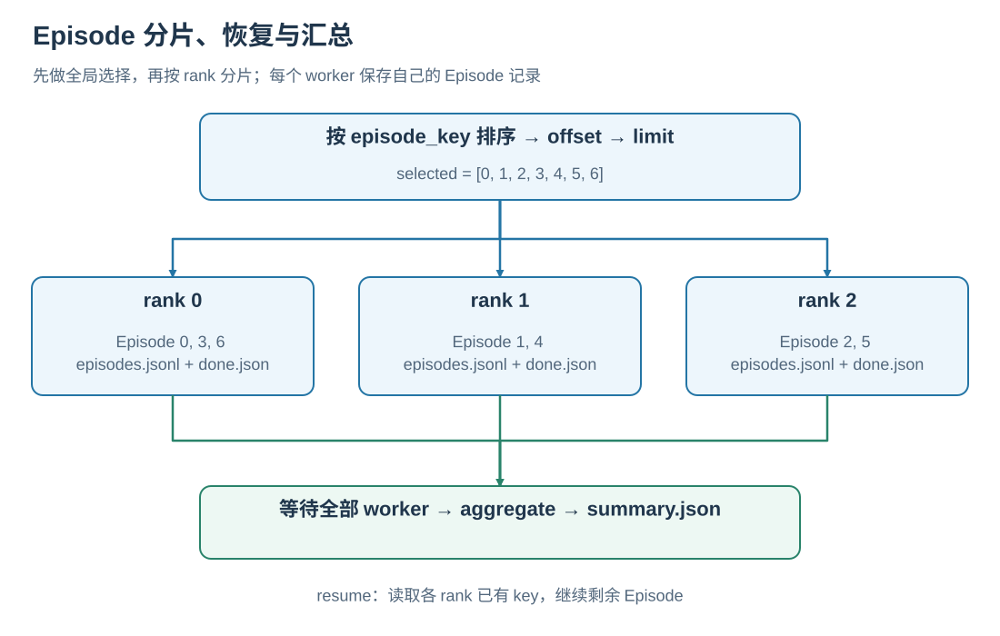

# Evaluation

本文说明 SatNav 当前统一在线评测接口。Classic 的 Random、ReferenceFollower、Seq2Seq、
CMA，以及 StreamVLN、NaVILA、Uni-NaVid、OpenFly 都通过同一个
`satnav.evaluation` rollout/result contract 运行。

Success、Oracle Success、SPL 和离开再返回规则的图解见[任务与评测原理](../concepts/TASKS_AND_METRICS.md)。

## 1. 评测流程

统一评测层负责：

- 按稳定 Episode key 排序、选择和分片；
- 为每个 Episode 提供稳定 seed；
- 调用 `PolicyAdapter` 与公开 `Env` API 完成 rollout；
- 按 rank 追加写入 JSONL；
- 中断后从已有 Episode 记录继续；
- 聚合标量指标并输出 `summary.json`。

每个 baseline 负责初始化自己的模型、tokenizer 或 processor，并通过 `PolicyAdapter`
接入统一评测层。这样可以让 Classic 与不同依赖环境中的 VLM 共用相同的 Episode 选择、
rollout 和结果格式。


## 2. 快速开始

仓库 tiny example 可通过以下命令完成 Classic 训练与评测：

```bash
bash scripts/quickstart_models.sh
```

首次运行前的依赖准备、训练阶段和输出路径参阅[模型训练](../training/README.md)。

直接运行统一 Classic CLI：

```bash
python -m baselines.classic \
  --method random \
  --config configs/baselines/random_agent.yaml \
  --split test \
  --limit 2 \
  --max-steps 5 \
  --output-dir output/baselines/classic/random-example
```

Canonical SatNav-v0.1 路径应放在 Git ignored 的
`baselines/classic/.local/env.sh` 中。配置完成后可运行：

```bash
bash scripts/classic/eval.sh random val_seen 8
bash scripts/classic/eval.sh reference_follower val_seen 8
bash scripts/classic/eval_parallel.sh random val_seen 2 0,1 8
```

`scripts/classic/eval.sh` 默认使用 `SATNAV_MAX_STEPS=5`。需要更长 rollout 时直接设置：

```bash
SATNAV_MAX_STEPS=500 bash scripts/classic/eval.sh random val_seen -1
```

### SatNav-v0.1 标准设置

`configs/benchmark/` 提供 SatNav-v0.1 的版本化评测参数：

| Split | 用途 | Episode 数 | 最大步数 | 配置文件 |
| --- | --- | ---: | ---: | --- |
| `val_seen` | Smoke | 4,574 | 5 | `satnav_v0_1_val_seen_smoke.json` |
| `val_seen` | Official | 4,574 | 500 | `satnav_v0_1_val_seen.json` |
| `val_unseen` | Smoke | 8,756 | 5 | `satnav_v0_1_val_unseen_smoke.json` |
| `val_unseen` | Official | 8,756 | 500 | `satnav_v0_1_val_unseen.json` |

Smoke 设置用于快速检查数据、模型和环境能否完成 rollout；报告正式 benchmark 结果时使用
Official 设置。启动评测时，通过 `--split`、`--limit` 和 `--max-steps` 选择相应运行规模。

Seq2Seq 和 CMA 还需要在本地 overlay 中配置对应 checkpoint 与 vocabulary；详细变量见
[`baselines/classic/local.env.example`](../../../baselines/classic/local.env.example)。

StreamVLN、NaVILA、Uni-NaVid 和 OpenFly 的已发布 checkpoint 位于
[SatNav Baseline Model Zoo](https://huggingface.co/collections/Eku127/satnav-baseline-model-zoo)。

## 3. Episode 选择与分片

每个 Episode 的稳定 key 为：

```text
<split>::<scene_id>::<episode_id>
```

评测按以下顺序处理 Episode：

1. 按稳定 key 排序；
2. 应用 `offset`；
3. 应用 `limit`；
4. 对选择结果做 stride sharding，rank `r` 获得 `selected[r::world_size]`。

`limit=-1` 表示选择 offset 之后的全部 Episode，`limit=0` 表示空选择。相同
`base_seed` 与 Episode key 会得到相同 seed，不受 rank 数量或启动顺序影响。

例如 7 个已选择 Episode、`world_size=3` 时：

```text
rank 0: episode 0, 3, 6
rank 1: episode 1, 4
rank 2: episode 2, 5
```

## 4. PolicyAdapter

所有 baseline 通过三个方法接入：

```python
class PolicyAdapter:
    def reset(self, context): ...
    def act(self, observation): ...
    def close(self): ...
```

`act()` 返回 `PolicyStep(action=..., info=...)`。模型 recurrent state、KV cache、历史帧、
action chunking 和 tokenization 都由 adapter 管理，不应进入通用 evaluator。

从最小 adapter 到真实模型、多 rank 和 resume 的完整接入流程参阅
[模型接入](../development/MODEL_INTEGRATION.md)。

`EpisodeContext` 提供当前 Episode、稳定 key、split、rank/world size、最大步数、seed 和
公开 environment 引用。Adapter 不应访问 `Env` 的私有字段。

## 5. 输出格式

单 rank 输出：

```text
output-dir/
├── rank_00000/
│   ├── episodes.jsonl
│   └── done.json
└── summary.json
```

多 rank 输出：

```text
output-dir/
├── rank_00000/
│   ├── episodes.jsonl
│   └── done.json
├── rank_00001/
│   ├── episodes.jsonl
│   └── done.json
└── summary.json
```

### 5.1 `episodes.jsonl`

每行对应一个完成或失败的 Episode。成功记录包含：

| 字段 | 含义 |
| --- | --- |
| `episode_key` | 稳定 Episode key |
| `episode_index` | 全局选择结果中的位置 |
| `rank` | 写入该记录的 rank |
| `status` | `ok` 或 `error` |
| `seed` | 当前 Episode seed |
| `episode` | scene、episode、trajectory 等逻辑标识 |
| `steps_taken` | 已执行 primitive action 数 |
| `terminated_by` | 环境终止原因或 `max_steps` |
| `initial_metrics` | reset 后标量指标 |
| `metrics` | Episode 结束时标量指标 |
| `initial_agent_state` | 初始 agent state，如环境可提供 |
| `final_agent_state` | 最终 agent state，如环境可提供 |
| `action_trace` | 可选的 action 与 policy info 序列 |

非标量 map/image metric 不进入 JSONL。默认结果不会序列化本机 `scene_path`。

Episode 失败时会写入有限的错误类型与通用消息，不写 traceback 或异常中可能包含的本机
路径。

### 5.2 `done.json`

Rank 完成本地 shard 后原子写入：

```json
{
  "schema_version": 1,
  "rank": 0,
  "status": "complete",
  "expected_count": 2,
  "record_count": 2,
  "error_count": 0
}
```

聚合器通过该文件读取 rank 的完成状态和记录计数。

### 5.3 `summary.json`

聚合结果包含：

```json
{
  "schema_version": 1,
  "status": "complete",
  "expected_episode_count": 2,
  "record_count": 2,
  "unique_record_count": 2,
  "ok_episode_count": 2,
  "error_episode_count": 0,
  "metrics": {
    "success": 0.5,
    "spl": 0.4
  }
}
```

指标是所有 `status=ok` 记录中相应有限数值的算术平均值。相同 Episode key 重复出现时，
聚合器保留最后一条记录并通过 `record_count` 与 `unique_record_count` 显示差异。

## 6. Resume

已有输出目录默认不会被追加，必须显式传 `--resume`：

```bash
python -m baselines.classic ... --output-dir output/run --resume
```

恢复流程：

1. 读取当前 rank 的 `episodes.jsonl`；
2. 如果最后一行是进程中断造成的不完整 JSON，则截断该尾部；
3. 收集已有 `episode_key`；
4. 跳过已有 key，只运行剩余 Episode；
5. 重新写入 `done.json`，单 rank 时重新聚合 summary。

仅当数据、模型、seed、`world_size` 和其他运行条件保持一致时，才应复用输出目录。
修改实验条件时请使用新的输出目录。

完整但非法的 JSONL 行仍会报错，不会被静默删除。

## 7. 多 rank 与聚合

所有 rank 必须使用相同的：

- Episode 文件和 split；
- `offset`、`limit`、`world_size`；
- `base_seed` 与 `max_steps`；
- 输出目录。

各 rank 结束后运行：

```bash
python scripts/evaluation/aggregate.py output/run
```

若任一 Episode error 应使命令失败：

```bash
python scripts/evaluation/aggregate.py \
  output/run \
  --fail-on-episode-error
```

聚合器读取输出目录中存在的 `rank_XXXXX` 子目录。启动脚本应等待所有 worker 成功结束后
再聚合；聚合器本身不会推断缺少了哪个 rank。



## 8. 错误策略

默认情况下，单个 Episode 异常会被持久化为 `status=error`，其余 Episode 继续执行。

- `--fail-fast`：写入当前错误记录后立即终止 worker；
- `--fail-on-episode-error`：完成 rollout/聚合后，只要存在错误记录就令命令失败；
- 两者都不设置：结果状态为 `completed_with_errors`，命令继续产出 summary。

## 9. Classic CLI 参数

Seq2Seq 和 CMA 从 SatNav-v0.1 数据准备到训练、单卡评测和多卡评测的完整流程参阅
[Classic Baselines](../training/CLASSIC.md)。

四种方法统一使用：

```bash
python -m baselines.classic --help
```

常用参数：

| 参数 | 含义 |
| --- | --- |
| `--method` | `random`、`reference_follower`、`seq2seq` 或 `cma` |
| `--config` | baseline YAML；省略时按方法选默认配置 |
| `--split` | 数据 split |
| `--output-dir` | 输出目录 |
| `--offset` / `--limit` | 全局排序后的选择范围 |
| `--rank` / `--world-size` | stride shard 参数 |
| `--seed` | base seed |
| `--max-steps` | 每个 Episode 最大 primitive action 数 |
| `--resume` | 跳过已有 Episode key |
| `--checkpoint` / `--vocab` | Seq2Seq/CMA 模型输入 |
| `--set KEY=VALUE` | 可重复的 OmegaConf override |
| `--print-config` | 只解析并打印配置，不创建 dataset/model |

## 10. VLM 入口

四个 VLM 使用各自独立环境和相同的 selection/result 参数：

```bash
python -m baselines.vlm.streamvln.evaluate --help
python -m baselines.vlm.navila.evaluate --help
python -m baselines.vlm.uninavid.evaluate --help
python -m baselines.vlm.openfly.evaluate --help
```

五步 smoke 直接使用 `--max-steps 5`：

```bash
bash baselines/vlm/streamvln/scripts/eval.sh \
  --model-path /path/to/model \
  --episodes /path/to/all_episodes.json \
  --scenes-dir /path/to/scenes \
  --limit 1 \
  --max-steps 5 \
  --output-dir output/baselines/vlm/streamvln/smoke
```

每个 VLM 的模型路径、上游 checkout、processor 和独立 Python 环境配置见下列 baseline 文档。
StreamVLN 的完整准备、训练和单卡/多卡评测流程参阅
[StreamVLN Baseline](../training/vlm/STREAMVLN.md)。
NaVILA 的完整准备、训练和单卡/多卡评测流程参阅
[NaVILA Baseline](../training/vlm/NAVILA.md)。
Uni-NaVid 的完整准备、训练和单卡/多卡评测流程参阅
[Uni-NaVid Baseline](../training/vlm/UNINAVID.md)。
OpenFly 的完整准备、训练和单卡/多卡评测流程参阅
[OpenFly Baseline](../training/vlm/OPENFLY.md)。

## 11. Python API

最小接入示例：

```python
from satnav.evaluation import (
    EvaluationConfig,
    Evaluator,
    PolicyAdapter,
    PolicyStep,
)

class StopPolicy(PolicyAdapter):
    def reset(self, context):
        self.context = context

    def act(self, observation):
        return PolicyStep(action=0, info={"reason": "example"})

    def close(self):
        pass

summary = Evaluator(
    environment=env,
    policy=StopPolicy(),
    config=EvaluationConfig(
        output_dir="output/example",
        split="test",
        policy_id="stop-policy",
        limit=2,
        max_steps=5,
    ),
).run()
```

`satnav.evaluation` 不导入 PyTorch 或任何 trainer；只有具体 baseline factory/adapter 可以
加载模型框架。

## 12. 常见问题

### 为什么已有输出目录拒绝启动？

目录内已有 rank 记录或 done marker。确认要继续同一次运行后添加 `--resume`；否则使用新
目录。

### 为什么 resume 后没有重新跑某个 Episode？

当前 rank 的 JSONL 已存在相同 `episode_key`。如需重跑，应使用新的输出目录，而不是手工
拼接不同运行的 JSONL。

### 为什么多 rank summary 的 Episode 数不正确？

确认所有 worker 使用相同 `world_size` 和输出目录，并且全部完成后再执行 aggregate。

### 为什么结果中没有 top-down map？

统一 JSONL 只保留标量 metrics，图像与 map payload 应由单独的 video/visualization hook
保存。

### 3 m 和 30 m LandmarkSet 阈值应使用哪个？

在线评测使用 `configs/satnav_eval_task.yaml` 中的 30 m；trajectory generation 配置中的
3 m 仅用于 expert waypoint 到达判断。
